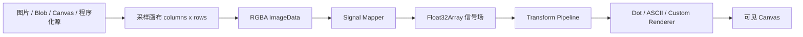

# MatrixEffect 组件开发设计文档

- 创建日期：2026-07-22
- 更新日期：2026-07-23（FX-2 完成后同步）
- 状态：FX-2 已完成，待启动 DEMO-1
- 组件 ID：`matrix-effect`
- 主要导出：`MatrixEffect`、`DotMatrixEffect`、`AsciiEffect`

## 设计结论

本需求最终采用“一套采样场渲染核心 + 两个易用预设”的形态，而不是分别实现互不相干的圆点组件和 ASCII 组件。

核心数据流固定为：

```text
Source -> Rasterize / Sample -> Signal Mapper -> Transform Pipeline -> Renderer -> Canvas
```

最终约束如下：

1. 使用 Canvas 2D 作为首版唯一输出后端，不引入 Three.js、PixiJS 或其他图形依赖。
2. 一个 registry item 内同时交付通用核心、圆点预设和 ASCII 预设。
3. 支持静态图片、外部 Canvas 和程序化动态源；首版不支持视频、摄像头、音频和 DOM 截图。
4. 网格是响应式的 `columns x rows`，不会强制为 `n x n`。默认按画布比例、单元格宽高比和性能上限计算行列数。
5. 自定义能力位于数据源、整帧信号转换和渲染器三个层级；高频热路径使用 TypedArray，避免为每个格子创建 React 元素或长期对象。
6. 动态渲染默认采用自适应 30/60 FPS、DPR 上限、最大单元格数、页面隐藏暂停和离屏暂停。
7. 默认尊重 `prefers-reduced-motion`：静态内容正常绘制；初始处于减少动态效果模式时绘制确定性静止帧，运行时切换则冻结当前成功帧。
8. 首版不内置鼠标或触摸输入，也不监听 Pointer Events；该能力作为后续兼容性扩展记录。

这套设计和 Shader 的“采样输入、转换信号、输出像素/图元”思路相似，但首版有两个不适合直接锁定 GPU Shader 的需求：

- ASCII 需要字体测量和字符绘制。
- 用户需要直接传入 JavaScript/TypeScript 自定义函数。

因此首版定位为 CPU 侧的采样场渲染引擎。未来可以增加 WebGL 渲染后端，但 JavaScript 转换器不能自动转换为 GLSL，届时必须定义独立的 GPU 插件契约。

### 2026-07-22 Review 完善结论

根据本轮对设计和执行计划的逐项 Review，采纳以下会影响实现一致性或验收可信度的建议：

- `MatrixEffect` 使用 `forwardRef + useImperativeHandle` 暴露 `MatrixEffectHandle`，两个预设转发同一 handle。
- 区分会导致管线失效的配置函数与不会触发重建的事件回调。
- 明确 Dot/ASCII 预设对局部 `grid` 配置的按模式合并规则。
- 为 `createLuminanceMapper()` 定义可选 RGB 权重参数。
- 监听 Reduced Motion 媒体查询的运行时变化，并定义暂停状态下 `invalidate()` 的 dirty 语义。
- `createCellRenderer()` 复用单个 scratch cell，禁止逐格分配对象。
- Dot/ASCII 预设统一使用 `backgroundColor`，只有底层核心保留 `clearColor`。
- 为自适应 FPS 验收增加可复现的 CPU throttling 和压力网格步骤。

Review 的 P3-1 已由执行计划 commit `e2169d2` 解决。关于既有 CodeBlock 路径失真和 authoring skill 说明过时的问题虽然属实，但不改变 MatrixEffect 设计，留作独立仓库维护任务，不纳入本功能范围。

## 背景与需求理解

目标不是对原图逐像素原样绘制，而是先把输入抽象为一个低分辨率场，再让场中每个单元格的采样信息控制最终图元的参数。

以两个参考效果为例：

- 圆点效果：源场亮度越高，圆点半径和/或透明度越大；动态源可以是缓慢移动的柔和光团。
- ASCII 效果：源场亮度映射到按视觉密度排序的字符集，低亮度和高亮度分别选择不同字符。

这里的“源”不必始终是一张可见图片。程序化动态源可以在内部采样画布上绘制径向渐变、噪声、波纹或其他连续场，再复用相同的映射和渲染管线。

## 目标

- 提供一个可通过 QiuYe UI registry 安装的通用视觉矩阵组件。
- 用同一套核心能力覆盖静态与动态输入。
- 内置圆点矩阵和 ASCII 两种完整、可直接使用的预设。
- 允许调用方替换数据源、信号映射、转换链或最终渲染器。
- 在桌面和移动端保持响应式布局，不因画布比例变化拉伸单元格。
- 对动态效果提供可预期的调度、暂停、清理和降级行为。
- 对远程图片加载、Canvas 污染、零尺寸容器和自定义回调异常给出明确错误。
- 保持无新增 npm 依赖，registry 安装后只依赖 React 和浏览器 Canvas API。

## 非目标

首版明确不包含：

- WebGL、WebGPU、GLSL 或 WGSL Shader 执行。
- 视频文件、`HTMLVideoElement`、摄像头流或屏幕共享流。
- 麦克风、音频频谱或节拍响应。
- DOM 节点截图或任意 React 子树栅格化。
- 内置鼠标、触摸、压力、速度或手势输入。
- PNG/JPEG/GIF/视频导出、录制或下载按钮。
- 服务端 Canvas 渲染、SSR 图片生成或后端处理服务。
- 用大量 DOM 节点或文本节点呈现每个网格单元。
- 自动把 JavaScript 转换器编译为 GPU Shader。
- 首版自动接入首页组件墙；详情页和组件目录接入属于必做，首页展示可在验收后单独决定。

## 当前工程背景

### 技术与发布形态

当前仓库使用：

- Next.js 15 App Router。
- React 19。
- TypeScript 5，严格模式。
- Tailwind CSS 4。
- shadcn/ui registry 分发。
- `next.config.ts` 中使用 `output: "export"` 静态导出。

组件必须是客户端组件，但不能依赖服务端 API。组件详情页必须通过 `generateStaticParams()` 被静态生成；当前详情页已经根据 `componentRegistry` 自动生成参数。

### 已有能力与差异

- `components/qiuye-ui/dot-glass.tsx` 是 CSS mask + backdrop-filter 特效，不读取图像像素，也没有 Canvas 生命周期，不能作为本组件核心复用。
- 仓库没有 Canvas/WebGL/ASCII 渲染组件，也没有 Three.js、PixiJS 等图形依赖。
- 仓库已有 `ResizeObserver`、`requestAnimationFrame`、`prefers-reduced-motion` 等使用案例，可以沿用其客户端清理习惯，但本组件需要形成独立且完整的渲染调度器。
- `public/registry/code-block.json` 已证明一个 registry item 可以包含多个源码文件。
- `scripts/update-registry.mjs` 会回填每个 `files[].content` 并生成 `public/registry/registry.json`，后者不能手工修改。

### pnpm 约束

`pnpm-lock.yaml` 使用 `lockfileVersion: '6.0'`。实现和验证必须显式使用 pnpm 8.x，例如：

```bash
npx -y pnpm@8.7.0 update-registry
npx -y pnpm@8.7.0 update-registry:dry
npx -y pnpm@8.7.0 lint
npx -y pnpm@8.7.0 build
```

不能直接使用较新的全局 pnpm 更新 lockfile。本组件计划不增加 npm 依赖，因此正常实现不应修改 `package.json` 或 `pnpm-lock.yaml`。

## 组件命名与交付形态

### Registry 身份

```text
组件 ID / cliName: matrix-effect
组件名称: Matrix Effect
分类: 特效
版本起点: 1.0.0
```

建议标签：

```text
canvas, matrix, grid, visual-effect, animation, dots, ascii, image,
procedural, sampling, generative, responsive
```

### 对外导出

```tsx
import {
  MatrixEffect,
  DotMatrixEffect,
  AsciiEffect,
  createSoftBlobSource,
  createLuminanceMapper,
  createLevelsTransform,
  createInvertTransform,
  createThresholdTransform,
  createTemporalSmoothingTransform,
  createDotRenderer,
  createAsciiRenderer,
  createCellRenderer,
} from "@/components/qiuye-ui/matrix-effect";
```

使用者只想获得参考效果时使用预设；需要自定义管线时再使用核心和工厂函数。

### 计划文件结构

```text
components/qiuye-ui/matrix-effect/
  index.ts
  matrix-effect.tsx
  sources.ts
  transforms.ts
  renderers.ts
  presets.tsx
  types.ts

components/qiuye-ui/demos/
  matrix-effect-demo.tsx
```

模块职责：

| 文件                | 职责                                                    |
| ------------------- | ------------------------------------------------------- |
| `types.ts`          | 公共类型、Source/Frame/Renderer/Props 契约              |
| `matrix-effect.tsx` | React 生命周期、尺寸观测、调度、采样画布和核心管线      |
| `sources.ts`        | 图片、Canvas、程序化源的规范化与 `createSoftBlobSource` |
| `transforms.ts`     | 亮度映射、反相、Levels、阈值、时间平滑                  |
| `renderers.ts`      | 圆点、ASCII 和自定义单元格渲染器工厂                    |
| `presets.tsx`       | `DotMatrixEffect`、`AsciiEffect` 易用封装               |
| `index.ts`          | 稳定公共导出入口                                        |

所有文件都属于同一个 `matrix-effect` registry item。组件源码只允许引用同一目录文件、React 和 `@/lib/utils`；若后续引入其他仓库本地文件，必须同步加入 registry `files[]`。

## 总体架构



### 为什么需要内部采样画布

所有栅格输入先绘制到一个仅有 `columns x rows` 像素的内部 Canvas。每个采样像素对应最终一个逻辑单元格，随后只需读取一次 `ImageData`。

优点：

- 大图不会按原始分辨率参与每帧计算。
- 图片、外部 Canvas 和程序化绘制共享同一条管线。
- 浏览器缩放和 `imageSmoothingEnabled` 可以完成首轮降采样。
- 100 x 100 网格只需要读取约 40 KB RGBA 数据，而不是整张全屏图片。

内部采样 Canvas 不挂载到 DOM。首版内部仍使用普通 `HTMLCanvasElement`，不强制使用 `OffscreenCanvas`，以保持 Safari 和静态站点兼容性。

### 单帧流程

1. 根据可见画布 CSS 尺寸计算 `columns`、`rows`、单元格宽高和有效 DPR。
2. 把当前 Source 绘制到 `columns x rows` 的内部采样 Canvas。
3. 调用 `getImageData()` 读取 RGBA；读取上下文使用 `{ willReadFrequently: true }` 提示。
4. Signal Mapper 把 RGBA 转换为主信号 `values: Float32Array`。
5. 按数组顺序执行 Transform Pipeline；转换器可以读取完整网格和上一帧结果。
6. 把非有限值归零，并把最终主信号限制到 `[0, 1]`。
7. Renderer 根据 RGBA、主信号和单元格几何信息绘制可见 Canvas。
8. 当前最终信号写入上一帧缓冲区，供下一帧的时间平滑或自定义算法使用。

网格、信号和上一帧 TypedArray 只在分辨率变化时重新分配。`getImageData()` 产生的 `ImageData` 分配属于 Canvas 2D API 的必要成本，不额外复制其 RGBA 数组。

## Source 设计

### 公共类型

```tsx
export type MatrixFit = "cover" | "contain" | "fill";

export interface MatrixSourcePosition {
  /** 水平位置，0 为左侧，0.5 为居中，1 为右侧 */
  x: number;
  /** 垂直位置，0 为顶部，0.5 为居中，1 为底部 */
  y: number;
}

export type MatrixImageInput = string | Blob | HTMLImageElement | ImageBitmap;

export interface MatrixImageSource {
  type: "image";
  src: MatrixImageInput;
  fit?: MatrixFit;
  position?: MatrixSourcePosition;
  smoothing?: boolean;
  background?: string | null;
  crossOrigin?: "anonymous" | "use-credentials";
}

export interface MatrixCanvasSource {
  type: "canvas";
  canvas:
    | HTMLCanvasElement
    | OffscreenCanvas
    | (() => HTMLCanvasElement | OffscreenCanvas | null);
  animated?: boolean;
  fit?: MatrixFit;
  position?: MatrixSourcePosition;
  smoothing?: boolean;
  background?: string | null;
}

export interface MatrixProceduralContext {
  ctx: CanvasRenderingContext2D;
  width: number;
  height: number;
  columns: number;
  rows: number;
  time: number;
  deltaTime: number;
  frame: number;
}

export interface MatrixProceduralSource {
  type: "procedural";
  draw: (context: MatrixProceduralContext) => void;
  animated?: boolean;
  background?: string | null;
}

export type MatrixSource =
  | MatrixImageSource
  | MatrixCanvasSource
  | MatrixProceduralSource;
```

`File` 继承自 `Blob`，无需单独加入联合类型。

### 默认行为

- 图片源默认为静态，加载和首次绘制成功后停止帧循环。
- Canvas 源的 `animated` 默认为 `false`；外部 Canvas 持续更新时必须显式设为 `true`。
- 程序化源的 `animated` 默认为 `true`。
- `fit` 默认为 `cover`，`position` 默认为 `{ x: 0.5, y: 0.5 }`。
- `smoothing` 默认为 `true`。
- `background` 默认为透明。

### 内部 Source Adapter 契约

`sources.ts` 把公共 Source 描述符规范化为仅供核心管线使用的 adapter。adapter 不进入 `index.ts` 公共导出，统一提供以下能力：

- `animated`：已经应用各 Source 类型默认值的连续绘制标记。
- `draw(context)`：向现有低分辨率采样上下文绘制，返回 `drawn`、`loading`、`idle` 或携带 `MatrixEffectError` 的 `error` 结构化结果，不把预期中的未就绪状态表示为异常。
- `dispose()`：幂等释放 adapter 自己创建的图片、object URL 和监听器；外部 Image、ImageBitmap 和 Canvas 始终只借用。
- 图片加载状态发生变化时通过内部回调请求核心重绘；adapter 已释放后必须忽略排队中的旧加载事件，不能唤醒或覆盖新 Source。

`draw()` 只负责清空/填充采样场并绘制 Source，不负责创建采样 Canvas、调用 `getImageData()`、调度帧或更新 React 状态。`sources.ts` 另提供采样读取异常分类函数，把 `getImageData()` 的 `SecurityError` 确定性映射为 `SOURCE_SECURITY_ERROR`，其他读取异常映射为 `SOURCE_RUNTIME_ERROR`。

图片和 Canvas 的 `cover` / `contain` 都保持源宽高比，position 在目标区域多余空间或溢出范围中对齐；`fill` 直接拉伸到整个采样场且忽略 position。position 的非有限值回退到 `0.5`，有限值限制到 `0..1`。零尺寸 Canvas 和返回 `null` 的 supplier 进入 `idle`，不清空最近一次成功输出，也不忙轮询。

图片使用 `naturalWidth / naturalHeight`，ImageBitmap 和 Canvas 使用 backing store 的 `width / height`，不读取 Canvas CSS 尺寸。`smoothing` 只控制 `imageSmoothingEnabled`，首版不承诺 `imageSmoothingQuality`。background 应为有效 CSS 颜色；无效字符串确定性回退为透明，不继承上一帧 Canvas 状态。

程序化 Source 必须在 `draw()` 调用中同步完成绘制；采样上下文是瞬时借用，不能保存后异步使用。意外返回 Promise 或同步抛错都映射为 `SOURCE_RUNTIME_ERROR`。核心收到该错误、切换 Source 或执行 Strict Mode 清理时，会同时丢弃采样 Canvas 并轮换上下文对象，确保已检测到的迟到异步 continuation 永久只能持有旧 `ctx`。每次实际绘制前，adapter 使用 identity transform 清空整个采样场，按需填充 background，并用 `save()` / `restore()` 隔离自身设置；程序化回调仍必须配平自己额外调用的 `save()` / `restore()`。

adapter 产生的 Source 错误都标记 `recoverable=true`，表示更换 Source 或相关配置后允许自动恢复；它不表示核心应对同一错误配置进行逐帧忙重试。

采样 Canvas 一旦被跨域输入污染，`clearRect()` 不能恢复 origin-clean。FE-1 在收到 `SOURCE_SECURITY_ERROR` 后必须丢弃该采样 Canvas；Source 变化触发自动重试时也必须创建新的 backing store 和 2D context，不能只复用并清空旧 Canvas。

### 程序化柔和光团源

`createSoftBlobSource()` 返回 `MatrixProceduralSource`，使用多个低分辨率径向渐变生成连续灰度场，不需要在可见画布上执行大面积 CSS blur。

```tsx
export interface SoftBlobSourceOptions {
  count?: number;
  minRadius?: number;
  maxRadius?: number;
  speed?: number;
  baseValue?: number;
  seed?: number;
}

export function createSoftBlobSource(
  options?: SoftBlobSourceOptions,
): MatrixProceduralSource;
```

- `count` 首版限制在合理范围内，例如 1 到 6。
- 半径使用相对短边的归一化比例。
- 轨迹由固定 seed、相位不同的正弦组合生成，相同参数在时间 `0` 必须得到相同画面。
- 初始即处于减少动态效果模式时使用时间 `0` 的静止帧；运行中切换时遵循全局冻结规则。
- 首版没有鼠标吸引、排斥或跟随逻辑。

### 资源所有权

- 组件内部为字符串 URL 或 Blob 创建的 `Image`、object URL 和监听器由组件清理。
- `crossOrigin` 只在组件为字符串 URL 创建内部 Image 时设置，并且先于 `src`；外部 `HTMLImageElement` 的 `src` 和 `crossOrigin` 不得修改。
- 尚未设置 `src` 的外部 HTMLImageElement 保持 `loading` 并继续监听；已有请求源、`complete=true` 且自然尺寸为 0 时才判定加载失败。
- 调用方传入的 `HTMLImageElement`、`ImageBitmap`、Canvas 不归组件所有；组件卸载时不得调用外部资源的 `close()` 或移除外部节点。
- Source 变化时使用版本令牌或 AbortController 忽略过期加载结果，避免慢图片覆盖新图片。
- 开发环境 React Strict Mode 重复挂载时，初始化和清理必须幂等。

## 响应式网格设计

### Grid 配置

```tsx
export type MatrixGridConfig =
  | {
      mode?: "auto";
      /** 目标单元格宽度，CSS px */
      cellSize?: number;
      /** 单元格宽 / 高；圆点通常为 1，ASCII 默认约为 0.6 */
      cellAspectRatio?: number;
      maxCells?: number;
      /** 自动模式不接受固定列数 */
      columns?: never;
      /** 自动模式不接受固定行数 */
      rows?: never;
    }
  | {
      mode: "fixed";
      columns: number;
      /** 不传时根据画布比例和 cellAspectRatio 推导 */
      rows?: number;
      cellAspectRatio?: number;
      maxCells?: number;
      /** 固定模式不接受自动模式的目标单元格宽度 */
      cellSize?: never;
    };
```

### 计算规则

优先级：

```text
grid.cellAspectRatio > renderer.cellAspectRatio > 1
```

自动模式中，`cellSize` 表示目标单元格宽度。单元格高度为：

```text
cellHeight = cellSize / cellAspectRatio
```

实现先计算 `columns = max(1, round(canvasWidth / cellSize))`，再使用实际列数计算：

```text
rows = max(1, round(columns * cellAspectRatio * canvasHeight / canvasWidth))
```

这样舍入后的网格仍优先保持单元格宽高比。固定模式的 columns 会舍入为正整数；非法 columns 回退到 auto 的 10px 推导，非法显式 rows 按未传处理并使用下述公式推导。

固定列数但未指定行数时：

```text
rows = round(columns * cellAspectRatio * canvasHeight / canvasWidth)
```

因此 2:1 的横向画布、100 列、正方形单元格会得到约 50 行，而不是强制 100 行。

如果计算结果超过 `maxCells`，按相同比例缩小行列数，保持画布比例和单元格宽高比。不能只截断最后若干单元格。

比例缩放使用 `scale = sqrt(maxCells / (columns * rows))` 并向下取整两轴。若缩放后任一轴小于 1，该轴固定为 1，另一轴直接限制到 `maxCells`；最终再次保证 `columns * rows <= maxCells`。因此 `10000 x 1`、`maxCells=100` 必须得到 `100 x 1`，不能因最小行数回夹而仍产生 1000 个单元格。`maxCells` 非法时回退 10000，并规范为至少 1 的整数。

由于网格本身也是内部采样 Canvas 的 backing store，应用 `maxCells` 后每个单轴还会限制为 16,384；只会进一步减少单元格，不会突破调用方给定的 `maxCells`。该限制主要保护显式超宽/超高 fixed 网格在 Safari 等浏览器中的可用性。

默认值：

| 场景            | cellSize |          cellAspectRatio | maxCells |
| --------------- | -------: | -----------------------: | -------: |
| 核心默认        |       10 | 取 renderer 提示，否则 1 |    10000 |
| DotMatrixEffect |       10 |                        1 |    10000 |
| AsciiEffect     |       10 |                      0.6 |     6000 |

### 预设 Grid 合并规则

Dot/ASCII 预设不能直接用核心默认值替换调用方传入的局部 `grid`，也不能把 auto 模式字段盲目浅合并到 fixed 模式。预设按当前 mode 做字段级合并：

```text
Dot 默认:   cellSize=10, cellAspectRatio=1,   maxCells=10000
ASCII 默认: cellSize=10, cellAspectRatio=0.6, maxCells=6000
```

- 未传 `grid`：使用完整预设默认值。
- `mode` 缺省或为 `"auto"`：保留用户显式传入的 `cellSize`、`cellAspectRatio`、`maxCells`，其余字段使用对应预设默认值。
- `mode="fixed"`：保留用户的 `columns` 和可选 `rows`；`cellAspectRatio`、`maxCells` 未传时使用对应预设默认值；不把 auto 的 `cellSize` 带入 fixed 配置。
- 所有调用方显式值优先于预设值，但最终仍经过非法值规范化和 `maxCells` 保护。

例如：

```tsx
<AsciiEffect grid={{ mode: "fixed", columns: 100 }} ... />
```

最终使用 100 列、自动推导 rows、`cellAspectRatio=0.6`、`maxCells=6000`，而不是回退到核心的 10000 cells。

调用方需要严格的 100 x 100 时可以显式配置：

```tsx
grid={{ mode: "fixed", columns: 100, rows: 100, maxCells: 10000 }}
```

固定模式也必须受 `maxCells` 保护。非法、负数或非有限配置回退到默认值，并在开发环境输出一次警告。

## 帧数据、映射与转换

### 公共帧类型

```tsx
export interface MatrixFrame {
  readonly columns: number;
  readonly rows: number;
  readonly rgba: Uint8ClampedArray;
  /** 当前主信号；Mapper 和 Transform 可以原地写入 */
  readonly values: Float32Array;
  /** 上一个成功绘制帧的最终信号；首帧或重置后为 null */
  readonly previousValues: Float32Array | null;
}

export interface MatrixFrameContext {
  /** 动画有效时间，秒；暂停期间不累计 */
  readonly time: number;
  /** 与上一个已绘制帧的间隔，秒，并限制异常大值 */
  readonly deltaTime: number;
  readonly frame: number;
  readonly cssWidth: number;
  readonly cssHeight: number;
  readonly cellWidth: number;
  readonly cellHeight: number;
  readonly dpr: number;
}

export type MatrixSignalMapper = (
  frame: MatrixFrame,
  context: MatrixFrameContext,
) => void;

export type MatrixSignalTransform = (
  frame: MatrixFrame,
  context: MatrixFrameContext,
) => void;
```

`values[index]` 与 `rgba[index * 4 ... index * 4 + 3]` 对应同一个单元格。行列计算为：

```text
row = floor(index / columns)
column = index % columns
```

自定义转换器因此可以访问上下左右邻居、整张场和上一帧，不会被限制为只能处理孤立单元格。

Mapper 和 Transform 都是同步瞬时回调，不能返回 Promise，也不能异步持有复用的 frame/context。核心运行时会把 thenable 返回值映射为对应阶段的结构化错误、吸收迟到 rejection，并丢弃可能被异步回调继续写入的旧缓冲。

### 默认亮度 Mapper

`createLuminanceMapper()` 支持可选 RGB 权重：

```tsx
export interface LuminanceMapperOptions {
  /** RGB 权重；默认使用 Rec.709。合法权重会按总和归一化。 */
  weights?: readonly [red: number, green: number, blue: number];
}

export function createLuminanceMapper(
  options?: LuminanceMapperOptions,
): MatrixSignalMapper;
```

默认使用 Rec.709 权重的视觉亮度近似：

```text
value = (0.2126 * R + 0.7152 * G + 0.0722 * B) / 255
```

三个权重必须是有限、非负数，且总和必须有限并大于 0；合法输入先按总和归一化，以确保标准 RGB 输入仍映射到 `[0, 1]`。非法权重回退到 Rec.709，并在开发环境只警告一次。`[1, 0, 0]`、`[0, 1, 0]`、`[0, 0, 1]` 可分别提取单一颜色通道。

Alpha 不直接混入主信号，保留在 RGBA 中由内置 Renderer 作为覆盖率处理。这样执行反相时，透明区域不会意外变为完全可见。

### 内置转换器

首版提供：

```tsx
createLuminanceMapper(options?: LuminanceMapperOptions)
createInvertTransform()
createLevelsTransform(options?: LevelsTransformOptions)
createThresholdTransform(options?: ThresholdTransformOptions)
createTemporalSmoothingTransform(options: TemporalSmoothingTransformOptions)
```

配置类型与默认值：

```tsx
export interface LevelsTransformOptions {
  inputMin?: number; // 默认 0
  inputMax?: number; // 默认 1
  brightness?: number; // 默认 0
  contrast?: number; // 默认 1
  gamma?: number; // 默认 1
}

export interface ThresholdTransformOptions {
  threshold?: number; // 默认 0.5
  softness?: number; // 默认 0，表示阈值两侧的过渡半宽
}

export interface TemporalSmoothingTransformOptions {
  responseMs: number; // 指数时间常数；0 表示立即跟随
}
```

所有工厂在创建时快照并规范化 options，之后修改传入对象或权重数组不会改变既有 Mapper/Transform。空 `values` 是 no-op。非法配置在开发环境按问题类型只警告一次。

精确语义：

- Invert：`value = 1 - value`。
- Levels 按固定顺序执行：
  1. `x = clamp((value - inputMin) / (inputMax - inputMin), 0, 1)`。
  2. `x = x ** (1 / gamma)`；因此 `gamma > 1` 会提亮中间调。
  3. `x = (x - 0.5) * contrast + 0.5`。
  4. `value = x + brightness`；最终 `[0, 1]` 限制仍由核心统一执行。
- Levels 的 input 范围允许任意有限值，但跨度必须有限且大于 0，否则整对回退到 `0/1`。非有限 brightness 回退 0，负数或非有限 contrast 回退 1，非正数、非有限或倒数非有限的 gamma 回退 1。
- Threshold 在 `softness=0` 时使用 `value >= threshold ? 1 : 0`，等于阈值归入高侧。`softness>0` 表示阈值两侧的过渡半宽，先计算 `t = clamp(0.5 + 0.5 * ((value - threshold) / softness), 0, 1)`，再使用 `t * t * (3 - 2 * t)` 平滑插值。非有限 threshold 回退 0.5，负数或非有限 softness 回退 0。
- Temporal smoothing 使用 `alpha = -expm1(-max(deltaTime, 0) / (responseMs / 1000))` 和 `value = previous + (current - previous) * alpha`。`responseMs` 是指数时间常数，即经过该时间后到达目标约 63.2%；`responseMs=0` 表示立即跟随，负数或非有限值也按 0 处理，避免错误配置冻结画面。
- Temporal smoothing 在 `previousValues=null` 或缓冲长度不一致时保留当前值；非有限或负数 `deltaTime` 按 0 处理。当前值非有限，或对应上一帧值非有限时，该格保留当前值，交给最终统一规范化。

转换器按数组顺序执行。内置 Transform 对非有限 signal 值不做有限化，核心只在全部转换结束后统一转换为 0 并限制到 `[0, 1]`，避免每个转换器额外扫描。

Mapper 执行前核心对复用的 `values` 调用 `fill(0)`，因此自定义 Mapper 即使只写部分位置，也不会继承上一次尝试的旧信号。单帧只有在 Renderer 成功并提交到可见 Canvas 后才算成功：此时才复制 `previousValues`、推进 frame、清除 dirty、进入 ready 并按需触发 `onReady`；Source、Mapper、Transform、Renderer 或提交阶段失败都不得推进这些状态。

Source、Mapper、Transform 身份变化以及任意 CSS 尺寸或网格变化会使 `previousValues` 对下一次尝试重新变为 null；只更换 Renderer 或 clearColor 不清除信号历史。网格尺寸不变时继续复用两块独立的 Float32Array，网格变化时才重新分配。

`createTemporalSmoothingTransform()` 必须放在转换链最后，因为 `previousValues` 保存的是上一帧全部 Transform 完成后的最终信号；如果其后还有改变值域的 Transform，前后帧将不在同一值域。首版不在运行时重排或强制检查调用方数组。

时间平滑只在持续绘制的动态源中保证逐帧收敛。静态源或 `playing=false` 下的一次 `invalidate()` 不会为平滑算法额外启动连续帧循环；这类场景应省略时间平滑，或由调用方继续显式触发重绘。

首版只有一个标准主信号通道。原始 RGBA 始终保留，因此 Renderer 仍可使用原图颜色。多命名数值通道作为未来扩展，不在首版引入通道注册表和额外内存管理。

## Renderer 设计

### 高性能整帧契约

```tsx
export interface MatrixRenderer {
  readonly cellAspectRatio?: number;
  readonly preferredFrameRate?: 30 | 60;
  prepare?(
    ctx: CanvasRenderingContext2D,
    frame: MatrixFrame,
    context: MatrixFrameContext,
  ): void;
  render(
    ctx: CanvasRenderingContext2D,
    frame: MatrixFrame,
    context: MatrixFrameContext,
  ): void;
  dispose?(): void;
}
```

Renderer 负责遍历网格并决定最终图元，不允许触发 React setState。`prepare()` 只在 Canvas、网格、DPR 或 Renderer 身份变化时调用，适合缓存字体指标或 Path 资源。

`prepare()`、`render()` 和 `dispose()` 都必须同步完成，不能返回 Promise 或异步持有借用的 ctx/frame/context。核心发现 `prepare()` / `render()` 返回 thenable 时会按 Renderer 运行时错误处理，并丢弃可能被迟到异步逻辑污染的 staging Canvas 与 frame 缓冲；`dispose()` 的 thenable/rejection 只会被吸收并记录开发期诊断，不进入渲染错误循环。Renderer 若额外调用 `ctx.save()`，必须在本次同步调用内配平对应的 `ctx.restore()`。

为兑现“运行时错误保留最近一次成功画面”，Renderer 不直接绘制已挂载的可见 Canvas。核心维护一个与目标 backing store 同尺寸的 staging Canvas，在其中依次清屏、调用 `prepare()` / `render()`；整帧成功后才一次性 blit 到可见 Canvas。Renderer 收到的 `ctx.canvas` 因此是内部 staging Canvas，不能依赖它与 `MatrixEffectHandle.canvas` 是同一节点，也不能自行挂载或替换该 Canvas。

Renderer 实例在一个时刻只能由一个 MatrixEffect 独占使用，除非调用方自行保证共享缓存和引用计数安全。组件在 Renderer 被替换或真正卸载后调用 `dispose()`；开发环境 Strict Mode 的立即 cleanup/setup 会被内部租约合并，不会仅因 effect 重放永久释放仍在使用的同一实例。`dispose()` 抛错只记录开发期诊断，不进入渲染错误循环。

### 自定义单元格便利适配器

`createCellRenderer(drawCell)` 为简单自定义效果提供易用入口：

```tsx
export interface MatrixRenderCell {
  index: number;
  column: number;
  row: number;
  x: number;
  y: number;
  centerX: number;
  centerY: number;
  width: number;
  height: number;
  u: number;
  v: number;
  value: number;
  r: number;
  g: number;
  b: number;
  a: number;
}

export function createCellRenderer(
  drawCell: (
    ctx: CanvasRenderingContext2D,
    cell: Readonly<MatrixRenderCell>,
    context: MatrixFrameContext,
  ) => void,
  options?: {
    cellAspectRatio?: number;
    preferredFrameRate?: 30 | 60;
  },
): MatrixRenderer;
```

这是便利 API，不是最高性能 API。适配器必须在每个 Renderer 实例内只创建一个可变 scratch cell，并在遍历每格时覆写其字段；禁止每格 `new` 或创建新的对象。回调收到的是只读、瞬时视图，调用方不得跨调用保存、异步读取或修改该对象。

`x/y/centerX/centerY/width/height` 使用 CSS 像素；`u/v` 是归一化网格坐标；`r/g/b/a` 保留采样 `ImageData` 的原始 `0..255` 通道值，不在便利适配器中预乘或归一化 Alpha。

高密度动态效果仍应直接实现整帧 `MatrixRenderer`，以便批量 Path、减少状态切换并完全绕开逐格回调成本。

### 圆点 Renderer

`createDotRenderer()` 支持：

- 主信号控制半径。
- 固定颜色或源图颜色。
- 独立的半径范围和透明度范围。
- 源 Alpha 覆盖率。
- 可选的值曲线。

内置单色圆点模式应把同色圆点尽量合并到一个 Path 后统一 `fill()`，不能为每个圆点单独 `beginPath()` + `fill()`。源图着色模式允许按单元格绘制，但默认降低性能预期。

### ASCII Renderer

```tsx
export interface AsciiRendererOptions {
  characters?: string | readonly string[];
  colorMode?: "fixed" | "source";
  color?: string;
  backgroundColor?: string | null;
  fontFamily?: string;
  fontWeight?: number | string;
  fontScale?: number;
}

export function createAsciiRenderer(
  options?: AsciiRendererOptions,
): MatrixRenderer;
```

`createAsciiRenderer()` 支持：

- 自定义字符字符串或字符数组。
- 字符按从低视觉密度到高视觉密度排列。
- 固定颜色或源图颜色。
- 自定义等宽字体、字重和字号缩放比例。
- 可选输出背景色。
- 全透明单元格与映射为空白 glyph 的单元格跳过绘制。

默认字符集：

```text
 .:-=+*#%@
```

字符索引：

```text
glyphIndex = round(value * (glyphCount - 1))
```

默认使用固定色 `#71717a`、字重 `400`、`fontScale=1` 和跨平台等宽字体栈 `ui-monospace, SFMono-Regular, Menlo, Monaco, Consolas, "Liberation Mono", "Courier New", monospace`。`fontScale` 表示 `fontSize = cellHeight * fontScale`，非有限或小于等于 0 时回退 1。ASCII 的默认 `cellAspectRatio` 为 `0.6`，允许调用方覆盖。

字符输入按以下规则规范化：

- 字符串使用 `Array.from()` 按 Unicode code point 拆分，不能 trim 掉默认字符集有意义的前导空格。
- 字符数组的每个成员视为一个完整 glyph token，并在工厂创建时复制快照；可用多 code point 字符表达组合 glyph。
- 显式空字符串或空数组回退默认字符集；`[""]` 或只含空白的非空字符集是合法输入，并确定性地不绘制对应 glyph。
- 只有一个 glyph 时，所有非透明单元格都映射到该 glyph，包括主信号值为 0 的格子。

Renderer 不引入额外的低值或 Alpha 阈值。`a=0` 的格子跳过，`0<a<255` 时以 `a/255` 作为最终覆盖率；空字符串或纯空白 glyph 跳过 `fillText()`。这样透明区域即使经过 invert 也不会生成字符块，同时字符密度仍严格服从上面的索引公式。

首版不依赖 DOM 文本测量。Renderer 只在 `prepare()` 中设置候选字体并调用一次 `measureText("M")` 缓存垂直对齐指标；`render()` 每帧在循环外重新应用缓存字体和文本状态，不逐格测量。核心已经应用 DPR transform，因此字号、坐标和可选 Renderer 背景填充都使用 CSS px；背景范围为 `context.cssWidth x context.cssHeight`。

单色 ASCII 可以缓存字体、字符索引和必要的字形资源。动态源色 ASCII 属于高成本模式，默认受 6000 单元格和 30 FPS 限制。

## MatrixEffect 核心 API

```tsx
export type MatrixFrameRate = "auto" | 30 | 60;
export type MatrixReducedMotion = "freeze" | "ignore";
export type MatrixEffectStatus = "idle" | "loading" | "ready" | "error";

export interface MatrixEffectError {
  code:
    | "SOURCE_LOAD_FAILED"
    | "SOURCE_SECURITY_ERROR"
    | "CANVAS_CONTEXT_UNAVAILABLE"
    | "SOURCE_RUNTIME_ERROR"
    | "MAPPER_RUNTIME_ERROR"
    | "TRANSFORM_RUNTIME_ERROR"
    | "RENDERER_RUNTIME_ERROR";
  message: string;
  recoverable: boolean;
  cause?: unknown;
}

export interface MatrixEffectHandle {
  readonly canvas: HTMLCanvasElement | null;
  /** 标记 dirty 并请求重绘一帧，适合静态外部 Canvas 或主题变化 */
  invalidate(): void;
}

export interface MatrixEffectProps extends Omit<
  React.HTMLAttributes<HTMLDivElement>,
  "children" | "dangerouslySetInnerHTML" | "onError"
> {
  source: MatrixSource;
  renderer: MatrixRenderer;
  mapper?: MatrixSignalMapper;
  transforms?: readonly MatrixSignalTransform[];
  grid?: MatrixGridConfig;
  playing?: boolean;
  frameRate?: MatrixFrameRate;
  maxDpr?: number;
  pauseWhenOffscreen?: boolean;
  reducedMotion?: MatrixReducedMotion;
  clearColor?: string | null;
  canvasClassName?: string;
  decorative?: boolean;
  ariaLabel?: string;
  fallback?: React.ReactNode;
  onStatusChange?: (status: MatrixEffectStatus) => void;
  onReady?: () => void;
  onError?: (error: MatrixEffectError) => void;
}
```

### Ref 与 Handle 契约

`MatrixEffect` 使用仓库既有的 `React.forwardRef` 约定，ref 明确指向 `MatrixEffectHandle`，不是根 `div` 或原生 Canvas：

```tsx
export const MatrixEffect = React.forwardRef<
  MatrixEffectHandle,
  MatrixEffectProps
>(function MatrixEffect(props, ref) {
  // 通过 useImperativeHandle 暴露 canvas 与 invalidate
});
```

- 使用 `React.useImperativeHandle()` 暴露稳定 handle；`canvas` 必须通过 getter 或更新同一 handle 对象的实时字段反映当前 `canvasRef.current`，不能在初始化时快照永久的 `null`。
- hydration/挂载前 `handle.canvas` 可以为 `null`。
- `MatrixEffectProps` 不声明另一个 `ref` 字段，避免与 `HTMLAttributes<HTMLDivElement>` 的根元素语义混淆。
- `DotMatrixEffect` 和 `AsciiEffect` 同样使用 `forwardRef<MatrixEffectHandle, ...>`，并把 ref 原样传给内部 `MatrixEffect`。
- 如果调用方需要根容器 DOM，应在外部包裹自己的元素；首版不再增加第二个 root ref API。

示例：

```tsx
const effectRef = React.useRef<MatrixEffectHandle>(null);

<DotMatrixEffect ref={effectRef} />;

// 例如主题颜色变化后请求静态效果重绘
effectRef.current?.invalidate();
```

默认值：

| Prop                 | 默认值                                   |
| -------------------- | ---------------------------------------- |
| `mapper`             | `createLuminanceMapper()`                |
| `transforms`         | `[]`                                     |
| `grid`               | auto、10px、renderer 宽高比、10000 cells |
| `playing`            | `true`                                   |
| `frameRate`          | `"auto"`                                 |
| `maxDpr`             | `2`                                      |
| `pauseWhenOffscreen` | `true`                                   |
| `reducedMotion`      | `"freeze"`                               |
| `clearColor`         | `null`，透明                             |
| `decorative`         | `true`                                   |

根节点负责尺寸和布局，可通过 `className`、`style` 设置宽高或 `aspect-ratio`。组件不会凭空决定固定高度；零尺寸时保持 `idle` 并等待 ResizeObserver，不视为错误。

`fallback` 在 `status="error"` 且尚无成功绘制帧时显示。若组件此前已有成功画面，运行时错误默认保留最后一帧而不以 fallback 覆盖。图片加载期间默认保持透明画布，不内置 Spinner。

身份变化分为两类处理：

- 管线配置：Source descriptor（包含 `source.draw` / Canvas supplier）、`mapper`、`transforms` 数组及成员、`renderer` 的身份变化会使对应管线阶段失效，并按最小范围重建缓存或请求重绘。调用方应把这些对象视为不可变配置，并使用 `useMemo` / `useCallback` 保持稳定身份；不支持原地修改同一个 descriptor 后期待自动检测。
- 事件回调：`onStatusChange`、`onReady`、`onError` 始终保存到 latest ref。它们的身份变化不重置 Source、不清空上一帧、不重建 Renderer，也不重启动画。调用方可以安全传入内联事件函数。

更新事件回调 ref 本身不得触发 `onReady` 重放或状态回调补发。

生命周期回调的同步异常不得进入管线错误锁；返回 thenable 时，其 rejection 会被消费并只记录开发期诊断。若用户回调通过同步重入切换 Source 或其他管线配置，核心使用 generation 与 adapter 身份校验放弃旧尝试，旧帧不能提交或触发新 Source epoch 的 `onReady`。

低频状态优先级固定为 `error > 零尺寸 idle > 图片 loading > Source idle > ready`。初始 idle 不主动补发 `onStatusChange`；只有值真实变化时才按“先更新 status，再调用 `onStatusChange`”处理。完整成功帧在 ready 状态更新后，再按当前 Source epoch 首次成功语义调用一次 `onReady`；图片 load 事件本身只唤醒重绘，不能提前触发。

Source epoch 按 Source descriptor 身份的每次提交变化递增，A -> B -> A 视为三个 epoch。Resize、invalidate、Mapper/Transform/Renderer 变化和 Strict Mode effect 重放都不重放同一 epoch 的 `onReady`。Source 切换会重置该 epoch 的 ready 标记和信号历史，但保留最近成功的可见画面；新 Source 尚在 loading 或发生错误时，已有成功画面不会被 fallback 覆盖。

## 预设组件 API

### DotMatrixEffect

```tsx
export interface DotMatrixEffectProps extends Omit<
  MatrixEffectProps,
  "source" | "renderer" | "mapper" | "transforms" | "clearColor"
> {
  source?: MatrixSource;
  blobOptions?: SoftBlobSourceOptions;
  color?: string | "source";
  backgroundColor?: string | null;
  /** CSS px，内部会限制到单元格可容纳范围 */
  radiusRange?: readonly [number, number];
  opacityRange?: readonly [number, number];
  invert?: boolean;
  levels?: {
    inputMin?: number;
    inputMax?: number;
    brightness?: number;
    contrast?: number;
    gamma?: number;
  };
  additionalTransforms?: readonly MatrixSignalTransform[];
}
```

未传 `source` 时自动使用 `createSoftBlobSource(blobOptions)`，因此以下代码直接得到动态柔和光团控制圆点的效果：

```tsx
<DotMatrixEffect
  className="aspect-square w-full"
  color="#a1a1aa"
  radiusRange={[0.2, 3.2]}
/>
```

预设内置转换顺序：

```text
Luminance -> optional Invert -> optional Levels -> additionalTransforms
```

### AsciiEffect

```tsx
export interface AsciiEffectProps extends Omit<
  MatrixEffectProps,
  "source" | "renderer" | "mapper" | "transforms" | "clearColor" | "grid"
> {
  source: MatrixSource;
  grid?: MatrixGridConfig;
  characters?: string | readonly string[];
  colorMode?: "fixed" | "source";
  color?: string;
  backgroundColor?: string | null;
  fontFamily?: string;
  fontWeight?: number | string;
  fontScale?: number;
  invert?: boolean;
  levels?: {
    inputMin?: number;
    inputMax?: number;
    brightness?: number;
    contrast?: number;
    gamma?: number;
  };
  additionalTransforms?: readonly MatrixSignalTransform[];
}
```

基础用法：

```tsx
<AsciiEffect
  source={{
    type: "image",
    src: "/examples/matrix-effect/source.webp",
    fit: "contain",
  }}
  characters=" .:=+*#%@"
  colorMode="fixed"
  color="#71717a"
  decorative={false}
  ariaLabel="由字符组成的示例图像"
  className="aspect-square w-full"
/>
```

预设内置转换顺序与 Dot 一致。

两个预设统一使用面向视觉语义的 `backgroundColor`，并在内部映射为核心 Canvas 的 `clearColor`；默认均为 `null`（透明）。底层 `MatrixEffect` 继续使用 `clearColor`，因为它表达 Renderer 执行前的 Canvas 清屏行为。预设不同时暴露这两个同义入口，避免优先级歧义。Source descriptor 自身的 `background` 只影响采样场，不影响输出 Canvas。

### 高级核心用法

```tsx
const source = React.useMemo(
  () => ({
    type: "procedural" as const,
    animated: true,
    draw: ({ ctx, width, height, time }) => {
      // 在低分辨率采样画布中绘制自定义动态场
    },
  }),
  [],
);

const renderer = React.useMemo(
  () =>
    createCellRenderer((ctx, cell) => {
      const size = cell.value * Math.min(cell.width, cell.height);
      ctx.fillRect(
        cell.centerX - size / 2,
        cell.centerY - size / 2,
        size,
        size,
      );
    }),
  [],
);

return <MatrixEffect source={source} renderer={renderer} />;
```

## Canvas 尺寸与 DPR

可见 Canvas 的 CSS 尺寸来自根容器。实际 backing store：

```text
effectiveDpr = min(window.devicePixelRatio, maxDpr)
canvas.width = round(cssWidth * effectiveDpr)
canvas.height = round(cssHeight * effectiveDpr)
```

除 `maxDpr` 外，内部将单个输出 backing store 严格限制在 4,194,304 像素，并把单轴限制为 16,384 像素以覆盖 Safari 等浏览器的 Canvas 尺寸边界。超出时继续降低有效 DPR，而不是创建可能导致内存峰值的超大 Canvas。可见 Canvas 和 staging Canvas 各自遵守总像素与单轴上限；低分辨率采样 Canvas 至少遵守相同的单轴上限，并由 `maxCells` 控制总像素。

FE-1 使用根容器稳定的整数 `clientWidth / clientHeight` 作为 CSS 尺寸，避免 ResizeObserver 亚像素抖动。backing 宽高按名义 effective DPR 四舍五入，并在可能超过上限时再次向下校正；Renderer 的坐标 transform 使用 `backingWidth / cssWidth` 与 `backingHeight / cssHeight` 两轴实际比例完整覆盖画布，`MatrixFrameContext.dpr` 仍报告应用像素预算前后得到的名义 effective DPR。

Renderer 使用 CSS 像素坐标；核心在每帧开始前重置 transform 并统一应用 DPR scale。不能在多帧中累积 `scale()`。

ResizeObserver 触发时：

1. 对 CSS 尺寸取合理精度，避免亚像素抖动造成反复重建。
2. 重新计算 backing store 和网格。
3. 仅在列数或行数变化时重建信号缓冲。
4. 清空上一帧缓冲，避免不同分辨率之间错误平滑。
5. 静态源也重绘一次。

缺少 ResizeObserver 时，降级为首次测量加 `window.resize` 监听；缺少 IntersectionObserver 时，只取消离屏暂停能力，不影响绘制。

## 动画调度与暂停

### 静态和动态模式

- 静态图片、`animated=false` Canvas 或程序化源：只在加载完成、尺寸变化、配置变化或 `invalidate()` 时绘制。
- `animated=true` Source：使用单一 `requestAnimationFrame` 循环。
- 组件内部不能使用 React state 驱动每一帧；React state 只用于 `status` 这类低频状态。

### `invalidate()` 的 dirty 语义

`invalidate()` 表示“现有输入或外部环境已经变化，需要一次新的成功绘制”，不是 `playing` 的别名：

- 每次调用都把组件标记为 dirty；同一事件循环或同一帧内的重复调用合并，不产生多次绘制。
- 动态循环已经运行时，由下一次既有 rAF 消费 dirty，不创建第二条 rAF 链。
- 页面可见、组件未触发启用中的离屏暂停且尺寸非零时，即使静态 Source、`playing=false` 或 Reduced Motion 已冻结，也调度至多一次 rAF 完成重绘；Reduced Motion 下沿用冻结的有效时间，初始尚无成功帧时使用 `time=0`。
- `playing=false`、静态 Source 或其他没有连续播放基准的一次性重绘使用 `deltaTime=0`；它不会为 Temporal smoothing 暗中启动额外帧。
- 页面隐藏、启用离屏暂停且组件离屏，或尺寸为零时，只保留 dirty，不在不可见状态强制绘制；恢复可绘制条件后的首帧消费它。
- 一次成功绘制后清除 dirty。Source 暂未就绪时不启动忙轮询；由 Source 就绪、下一次显式 `invalidate()` 或动态循环的后续帧重试。
- 未恢复的运行时错误仍按错误恢复规则处理；单独调用 `invalidate()` 不清除错误锁，只有 Source 或管线配置变化才触发自动重试。

因此“暂停时无活动 rAF”指没有持续循环；可见状态下由 `invalidate()` 合并产生的一次性 rAF 必须在绘制后结束。

### 自适应帧率

`frameRate=30` 或 `60` 时按固定上限跳帧；`"auto"` 时：

- Dot Renderer 首选 60 FPS。
- ASCII Renderer 首选 30 FPS。
- 自定义 Renderer 使用其 `preferredFrameRate`，未声明时首选 60 FPS。
- 60 FPS 模式出现持续的渲染超预算或连续丢帧时降到 30 FPS。
- 恢复到 60 FPS 必须经过更长的稳定窗口和冷却时间，避免在 30/60 之间抖动。
- 自动模式只调整帧率，不在动画中突然改变网格分辨率，以免画面出现明显跳变。

固定和自动模式都使用 rAF timestamp 的 deadline 门控，30/60 FPS 间隔分别为 `1000 / 30` 与 `1000 / 60` ms，并使用 0.5ms 提前容差吸收 59.94/60Hz 浮点抖动。大间隔后只绘制一帧并把 deadline 前推到未来，不补画历史帧。动态运行中的 `invalidate()` 由下一个获准绘制 slot 消费，不能绕过帧率上限；暂停或静态模式的一次性 dirty 重绘不受连续帧 deadline 限制。

自动模式的确定性控制器规则如下：

- `preferredFrameRate=30` 是 auto 上限，不会因负载较低升到 60；只有首选 60 的 Renderer 参与 60/30 切档。
- 使用时间归一化 EMA，时间常数固定为 1000ms，`alpha = -expm1(-elapsedMs / 1000)`。
- 完整管线耗时只采样成功提交的连续帧，范围从 Source 绘制到可见 Canvas blit，不含生命周期回调；一次性重绘、loading/idle、错误和 generation 放弃不计入 cost。
- 单一连续 rAF 链的每次 callback 都采样 miss，原始间隔 `>=25ms` 记为 1，否则记为 0；暂停恢复会清空 rAF 间隔基准。
- 60 档在 cost EMA `>=12ms` 或 miss EMA `>=0.2` 持续 2000ms 后降到 30。
- 30 档只有在 cost EMA `<=8ms`、miss EMA `<=0.05` 持续 10000ms，且距最近一次降级至少 20000ms 时才升回 60。
- 切档后清空压力/稳定窗口并从新档位的下一个 deadline 继续。暂停保留当前档位但清空 miss 基准和窗口；frameRate 模式、Renderer 身份或 FPS 提示变化会重建控制器，其他管线负载变化只清空样本并保留当前档位。

### 时间语义

- `time` 使用组件有效播放时间，而不是页面绝对时间。
- 页面隐藏、离屏或手动 `playing=false` 时不累计有效时间。
- 恢复后的首帧重置时间基准，不允许出现数秒级 `deltaTime` 导致光团跳跃。
- 连续帧的单次有效增量严格限制为 0.1 秒；`time` 和 `deltaTime` 使用同一个受限增量，避免直接消费绝对 `time` 的程序化 Source 在长阻塞后跳跃。
- 播放时钟只在完整帧成功提交时与 previousValues/frame/dirty 一起事务推进；loading/idle、错误或旧 generation 尝试都不推进。
- 新 Source epoch 把 `time` 重置为 0；其他配置变化、暂停和错误恢复保留已提交的有效时间，但清空连续时间基准。
- 静态 Source、`playing=false` 和 Reduced Motion freeze 下的一次性重绘沿用冻结时间且 `deltaTime=0`，成功后也不建立连续基准。

### 暂停条件

调度条件分为两层。以下硬阻塞同时禁止连续帧和一次性 dirty 重绘，dirty 保留到恢复：

- `document.visibilityState !== "visible"`。
- `pauseWhenOffscreen=true` 且 IntersectionObserver 判断组件离开视口。
- 组件宽高为 0。
- 发生未恢复的运行时错误、尚未挂载或 Source adapter 不可用。

以下条件只停止连续播放；页面可见且尺寸非零时仍允许一次性 dirty 重绘：

- `playing=false`。
- `prefers-reduced-motion: reduce` 且 `reducedMotion="freeze"`。
- Source adapter 的 `animated=false`。

初始 `playing=false` 或初始 Reduced Motion 下，动态 Source 仍消费初始 dirty，以 `time=0` 绘制一张静止帧。离屏观测固定使用 `rootMargin="128px 0px"`、threshold 0；支持 IntersectionObserver 时等待首次回调确定可见性，缺少 API 或构造/observe 失败时 fail-open 为可见。暂停时必须取消连续循环 rAF，而不是继续每帧执行后直接 return；一次性 invalidation 遵循上文 dirty 规则。

## 减少动态效果与可访问性

### Reduced Motion

默认 `reducedMotion="freeze"`：

- 静态图片和静态 Canvas 正常绘制。
- 客户端初始媒体查询已经匹配 `reduce` 时，动态 Source 在首次可绘制时使用 `time=0` 绘制首个成功帧后停止。
- 运行中从非 reduce 切换为 reduce 时，立即取消连续 rAF，并冻结最近一次成功画面及其有效播放时间；若尚无成功帧，才在恢复可绘制条件后使用 `time=0` 绘制一次。
- 冻结期间由配置变化或 `invalidate()` 触发的必要重绘使用被冻结的有效时间，不推进动画。
- 从 reduce 切回非 reduce 后，仅在 `playing`、页面可见、未触发离屏暂停、尺寸和错误状态都允许时恢复；恢复首帧重置 rAF 时间基准，reduce 持续时间不计入 `time` 或 `deltaTime`。
- 不把整个 Canvas 隐藏，避免丢失仍有视觉意义的内容。

组件在客户端创建 `window.matchMedia("(prefers-reduced-motion: reduce)")`，监听其 `change` 事件并即时应用以上切换规则。监听器必须在卸载、媒体查询对象替换或 Strict Mode effect 重放时完整清理；兼容只提供 `addListener/removeListener` 的旧实现。缺少 `matchMedia` 时按未匹配处理。

只有明确需要且不造成可访问性问题时，调用方才能设置 `reducedMotion="ignore"`。

### Canvas 语义

视觉特效默认是装饰性的：

```text
decorative=true -> canvas aria-hidden=true
```

如果 ASCII 图像承载内容：

```text
decorative=false -> canvas role=img，并要求 ariaLabel
```

开发环境中 `decorative=false` 但缺少 `ariaLabel` 时输出一次警告。Canvas 不可用或发生错误时，调用方可以通过 `fallback` 提供静态图片或替代文本。

首版没有键盘、焦点或指针交互，因此 Canvas 本身不进入 Tab 顺序。

## 颜色与主题行为

Canvas 是即时栅格输出，绘制后的颜色不会像 DOM CSS 一样自动随主题变量更新。

首版规则：

- 内置预设接受普通 CSS 颜色字符串或源图颜色。
- 默认圆点颜色使用明确的中性色，不依赖 `next-themes`。
- Demo 如需随深浅主题变化，应读取当前主题并传入新的 `color` / `backgroundColor`，让 Renderer 身份或配置变化触发重绘。
- 调用方也可以在主题变化后调用 `ref.current.invalidate()`。
- 首版不解析任意 `var(--token)` 字符串，也不在组件内部依赖 `next-themes`。

## 错误处理

### 图片加载与 CORS

Canvas 一旦绘制了不允许跨域读取的图片，`getImageData()` 会抛出 `SecurityError`。组件不能绕过浏览器安全模型。

规则：

- 远程 URL 默认使用调用方配置的 `crossOrigin`；Demo 优先使用同源本地资产。
- 远程服务器必须返回合适的 `Access-Control-Allow-Origin`。
- 已经加载的外部 `HTMLImageElement` 是否安全由调用方来源决定。
- 捕获到安全错误时上报 `SOURCE_SECURITY_ERROR`，停止循环，并说明需要同源或 CORS 资源。
- 不增加服务端图片代理作为兜底。

### 运行时异常

Source、Mapper、Transform、Renderer 的同步异常或非法 Promise 返回值分别映射到不同错误 code。单次配置发生错误后：

1. 停止当前帧循环，防止每帧重复抛错和调用 `onError`。
2. 保留最近一次成功画面；若没有成功画面则使用 clearColor 或透明。
3. `status` 进入 `error`。
4. Source 或管线配置变化时自动重试。

错误回调本身的异常不能再次进入渲染循环。

### 边界输入

- 宽高为 0：等待尺寸，不报错。
- 图片尚未完成加载：状态为 `loading`。
- 外部 Canvas supplier 返回 null：保持 idle，并在 `invalidate()` 或下一次动态帧重试；不每帧打印警告。
- 字符集为空：回退默认字符集并开发期警告。
- 只有一个字符：所有有效单元格使用该字符。
- `inputMin >= inputMax`、负半径、非法 Gamma：规范化到安全值并开发期警告。
- 自定义 Transform 写入非有限值：最终统一转换为 0。

## 性能预算与实现约束

### 默认预算

| 项目                  |   Dot | ASCII |
| --------------------- | ----: | ----: |
| 默认最大单元格数      | 10000 |  6000 |
| 自动模式首选 FPS      |    60 |    30 |
| 默认最大 DPR          |     2 |     2 |
| 离屏暂停              |    是 |    是 |
| 页面隐藏暂停          |    是 |    是 |
| Reduced Motion 静止帧 |    是 |    是 |

这些是默认保护值，不是对所有硬件的绝对帧率承诺。验收重点是组件能在压力下稳定降到 30 FPS，不持续占用不可见页面资源，也不造成 React 每帧提交。

### 不得违反的热路径规则

- 不为每个单元格创建 DOM/React 节点。
- 不在每帧 setState。
- 不在每帧重建采样 Canvas、TypedArray、字体配置或 Renderer。
- 不在 ASCII 的每个格子中调用 `measureText()`。
- 不在 Dot 单色模式中逐点独立 `fill()`。
- 不在配置未变化时重复加载图片或创建 object URL。
- 不在暂停状态保留活动 rAF。
- 不把完整高分辨率源图做 `getImageData()`；只读取网格分辨率采样画布。

### 性能观测

开发 Demo 可以展示实际 `columns x rows` 和当前目标 FPS，但核心不应提供高频 React `onFrame` 回调。若需要调试指标，优先通过仅开发环境的内部统计或低频回调后续扩展，避免测量能力本身成为性能问题。

### 自适应 FPS 的可复现压力验收

QA 使用统一场景验证降级滞后和升级冷却，避免只凭主观观察判断：

1. 使用动态 Dot 场景，设置 `grid={{ mode: "fixed", columns: 160, rows: 100, maxCells: 16000 }}`、`frameRate="auto"`，先在无 CPU 限速时确认画面非空且目标帧率为 60。
2. 在 Chrome DevTools 启用 4x CPU throttling；若连续观察 15 秒仍未形成持续超预算，再改为 6x。测试记录必须注明实际倍率。
3. 在压力下持续观察至少 15 秒，目标帧率必须降到 30；降级后继续保持同等压力至少 10 秒，不得回升或在 30/60 之间切换。
4. 解除 CPU 限速后继续观察至少 30 秒。只有经过实现定义的稳定窗口和冷却期才能从 30 升到 60；观察窗口内最多发生一次升级，不得反复振荡。
5. 同时确认网格仍为 `160 x 100`、Canvas 持续非空，且降级过程没有触发 React 每帧 commit。

当前目标 FPS、最近一次档位切换时间等观测信息可以通过仅开发环境的内部指标或测试插桩读取，不为此新增公共高频 `onFrame` API。若 6x 限速仍不能触发降级，应记录机器、浏览器和耗时数据，再调整实现阈值或增加仅测试用 Renderer 压力，而不能直接把该项判为通过。

## Demo 与用户可见行为

完整 Demo 至少包含三个场景。

### 1. 柔和光团圆点矩阵

- 使用默认 `DotMatrixEffect` 和 `createSoftBlobSource()`。
- 浅色背景、中性圆点，视觉方向贴近参考图一。
- 光团缓慢、连续移动，不使用突变随机数。
- 可调整网格密度、半径范围、速度、对比度和反相。
- Reduced Motion 下显示构图完整的静止帧。

### 2. 静态图片转 ASCII

- 使用同源本地示例图片，避免线上 Demo 因 CORS 失效。
- 使用 `fit="contain"` 保留完整主体。
- 可切换固定色/源图色、字符集、反相和采样密度。
- 默认静态图片只绘制一次。
- 视觉方向贴近参考图二，但不要求复制参考图片本身。

### 3. 自定义管线

- 使用 `MatrixEffect` + 自定义 Transform 或 `createCellRenderer()`。
- 示例应明显展示“同一 Source、更换映射/绘制逻辑即可得到新效果”。
- 示例代码保持短小，避免把完整引擎逻辑复制到 Demo。

详情页快速预览使用 `DotMatrixEffect`，尺寸稳定且无需网络资源。完整 Demo 的容器必须设置稳定高度或 `aspect-ratio`，避免 Canvas 加载和动态内容造成布局跳动。

## 仓库接入设计

实现阶段需要同步以下位置：

1. `components/qiuye-ui/matrix-effect/*`：核心、多文件模块和公共导出。
2. `components/qiuye-ui/demos/matrix-effect-demo.tsx`：完整 Demo。
3. `app/components/[id]/simple-demos.tsx`：新增 `MatrixEffectSimpleDemo`。
4. `app/components/[id]/page.tsx`：导入 Demo 和简单 Demo，加入两个映射。
5. `lib/component-constants.ts`：新增 `MATRIX_EFFECT = "matrix-effect"` 和基础用法。
6. `lib/registry.ts`：新增 `Matrix Effect` 元信息；因为有三个主要组件，使用 `propsInfo`。
7. `public/registry/matrix-effect.json`：列出目录内全部交付文件。
8. `packages/qiuye-ui-cli/bin/qiuye-ui-mcp.mjs`：把 `matrix-effect` 加入 `DEFAULT_COMPONENT_NAMES` fallback。
9. `README.md`、`AGENT.md` 等真实组件清单：补充新组件。
10. 运行 `npx -y pnpm@8.7.0 update-registry` 生成 content 和 registry 清单。

当前 `app/cli/page.tsx` 的组件数据来自 `getAllComponents()`，并非固定“全部组件 ID”数组。新增 registry 元数据后可自动出现在相关列表中，因此除非要把 Matrix Effect 放入首页优先推荐位，否则不需要为了组件 ID 手工修改该页面。

`lib/registry.ts` 中的文件元信息固定为：

```tsx
files: {
  component: "components/qiuye-ui/matrix-effect/index.ts",
  demo: "components/qiuye-ui/demos/matrix-effect-demo.tsx",
  types: "components/qiuye-ui/matrix-effect/types.ts",
}
```

建议 registry item：

```json
{
  "$schema": "https://ui.shadcn.com/schema/registry-item.json",
  "name": "matrix-effect",
  "title": "MatrixEffect",
  "type": "registry:component",
  "author": "QiuYeDx <me@qiuyedx.com>",
  "dependencies": [],
  "registryDependencies": [],
  "files": [
    {
      "type": "registry:component",
      "path": "components/qiuye-ui/matrix-effect/index.ts"
    },
    {
      "type": "registry:component",
      "path": "components/qiuye-ui/matrix-effect/matrix-effect.tsx"
    },
    {
      "type": "registry:component",
      "path": "components/qiuye-ui/matrix-effect/sources.ts"
    },
    {
      "type": "registry:component",
      "path": "components/qiuye-ui/matrix-effect/transforms.ts"
    },
    {
      "type": "registry:component",
      "path": "components/qiuye-ui/matrix-effect/renderers.ts"
    },
    {
      "type": "registry:component",
      "path": "components/qiuye-ui/matrix-effect/presets.tsx"
    },
    {
      "type": "registry:component",
      "path": "components/qiuye-ui/matrix-effect/types.ts"
    }
  ]
}
```

`public/registry/registry.json` 只能由脚本生成，不能手改。Demo 文件不随组件 registry 安装，无需放入 item 的 `files[]`。

## 浏览器兼容与静态导出

最低依赖能力：

- Canvas 2D、`drawImage()`、`getImageData()`。
- `requestAnimationFrame`。
- `matchMedia`。
- 可选增强：ResizeObserver、IntersectionObserver、ImageBitmap、OffscreenCanvas 输入。

组件文件顶部使用 `"use client"`。任何 `window`、`document`、`HTMLImageElement`、`matchMedia` 和 Observer 访问必须位于 effect、事件或带 `typeof` 保护的客户端路径中，不能在模块初始化或服务端预渲染阶段直接执行。

静态导出构建期间只输出 Canvas 容器标记，不加载图片和启动动画；客户端 hydration 后初始化。

## 安全与资源限制

- 不使用 `eval`、动态脚本或用户提供的 Shader 字符串。
- ASCII 字符通过 Canvas `fillText()` 绘制，不插入 HTML。
- 自定义函数本身属于调用方受信代码，组件只负责捕获和隔离其运行时异常。
- 远程图片遵循浏览器 CORS，不代理或绕过权限。
- 默认 `maxCells` 和 backing-store 像素上限用于降低误配置导致页面冻结的风险。
- 调用方可以显式提高 `maxCells`，但开发环境应对明显过大的配置发出一次警告。
- Blob object URL、事件监听、Observer、rAF 和内部 Canvas 引用在 Source 变化或卸载时全部清理。

## 后续版本可扩展点

### 指针与触摸输入

首版不监听任何鼠标或触摸事件。后续如果出现明确交互场景，可以增加可选 Pointer Events 输入层：

```tsx
export interface MatrixPointerState {
  x: number;
  y: number;
  velocityX: number;
  velocityY: number;
  pressure: number;
  active: boolean;
  pressed: boolean;
}
```

可扩展效果包括：

- 指针附近圆点放大、缩小、吸引或排斥。
- 移动速度驱动波纹和拖尾。
- ASCII 在指针附近恢复清晰度、密度或原图颜色。
- 触摸按压产生扩散场，松开后按时间衰减。

未来需要同时解决：

- 监听目标是 Canvas、window 还是外部元素。
- 装饰性全屏 Canvas 如何保持 `pointer-events: none` 和底层点击穿透。
- 多点触控、离开画布、按压取消和压力缺失的降级。
- Reduced Motion 下是否禁用跟随和波纹。

向 `MatrixFrameContext` 添加可选 `pointer` 字段属于向后兼容的类型扩展，因此首版无需提前安装事件监听器或暴露无实际行为的 Props。

### 其他扩展

- WebGL Renderer：面向更高单元格数和全屏 60 FPS，但使用独立 GPU 插件契约。
- 视频/摄像头：增加媒体生命周期、自动播放权限和跨域处理。
- 音频输入：把频谱或节拍转为一个或多个信号场。
- OffscreenCanvas + Worker：降低主线程压力，但自定义回调需要可传输/可序列化边界。
- 多信号通道：除主 `value` 外提供 angle、velocity、depth 等命名 TypedArray。
- 输出捕获：`toBlob()`、静态图片导出或录制。
- 更多 Renderer：线段、方块、十字、图标 atlas、粒子实例。

这些扩展不能提前污染首版 API；只有在出现真实用例后再增加。

## 风险与应对

| 风险                                       | 影响           | 应对                                                     |
| ------------------------------------------ | -------------- | -------------------------------------------------------- |
| 10000 个图元在低端移动设备上超预算         | 掉帧、耗电     | 自动降至 30 FPS、maxCells、离屏和隐藏暂停                |
| 动态 ASCII 大量 `fillText`                 | CPU 占用高     | 默认 6000 cells / 30 FPS、跳过空字符、缓存字体指标       |
| 远程图片污染 Canvas                        | 无法读取像素   | 同源 Demo、明确 crossOrigin、结构化安全错误              |
| 响应式容器尺寸频繁抖动                     | 反复分配和闪烁 | 尺寸取整、只在网格变化时重建缓冲                         |
| Source/Renderer 每次 React render 都换身份 | 重置动画和缓存 | 文档要求 useMemo/useCallback，内部缩小失效范围           |
| React Strict Mode 双 effect                | 重复 rAF/监听  | 幂等初始化、统一 cleanup、版本令牌                       |
| 页面恢复后 deltaTime 过大                  | 动画跳跃       | 暂停不累计时间、恢复重置基准、限制 deltaTime             |
| Canvas 颜色不自动响应主题                  | 静态帧颜色过期 | 主题变化传新颜色或调用 invalidate，Demo 显式处理         |
| 自定义回调无限耗时                         | 主线程阻塞     | 默认单元格限制、错误隔离；无法抢占同步用户代码需文档说明 |
| 过度抽象导致简单用法复杂                   | 使用门槛高     | Dot/ASCII 预设覆盖常见用法，核心 API 面向高级用户        |

## 验证与验收方案

### 静态检查

```bash
npx -y pnpm@8.7.0 update-registry
npx -y pnpm@8.7.0 update-registry:dry
npx -y pnpm@8.7.0 lint
npx -y pnpm@8.7.0 build
```

验收：

- lockfile 仍为 v6，且本功能没有引入依赖变动。
- registry dry run 不再报告 `matrix-effect` 源码 content 不同步。
- 静态导出包含 `/components/matrix-effect/`。
- registry JSON 能安装全部目录文件，`index.ts` 导出无缺失。

### 功能验证

- 静态图片首次加载后只绘制一帧；Resize 或 invalidate 会重绘。
- `MatrixEffect` 与两个预设都能通过 ref 访问同一个 `MatrixEffectHandle`；重复 invalidate 合并为一次绘制。
- 动态光团连续运行，暂停和恢复无时间跳跃。
- 外部动态 Canvas 能持续采样；静态 Canvas 可通过 invalidate 更新。
- 自定义 Mapper 可以读取 RGB，自定义 Transform 可以访问邻居和上一帧。
- 自定义亮度权重可分别提取 R/G/B 通道，非法权重确定性回退到 Rec.709。
- 事件回调身份变化不重建 Source/Renderer 或重启动画。
- Dot 半径和 ASCII 字符都随输入信号正确变化。
- `invert`、Levels、阈值和时间平滑顺序符合文档。
- 图片 `cover`、`contain`、`fill` 和 position 正确。
- 远程 CORS 失败只触发一次结构化错误，不形成异常循环。

### 响应式验证

至少验证：

- 1440 x 900 桌面视口。
- 390 x 844 移动视口。
- 2:1 横向容器、1:1 方形容器和 1:2 纵向容器。
- 固定 100 列未指定 rows 时，rows 随比例变化。
- ASCII 单元格使用约 0.6 宽高比，不被拉伸成方形字格。
- DPR 1、2 和设备 DPR 大于 2 时 backing store 符合上限。

### 动画和资源验证

- 滚出视口后 rAF 停止，重新进入后恢复。
- 切换到后台标签页后 rAF 停止。
- 初始 Reduced Motion 下动态源绘制 `time=0` 静止帧；运行中打开该设置冻结当前成功帧，关闭后从冻结时间连续恢复。
- `playing=false` 时 invalidate 仍可合并重绘一帧；页面隐藏或离屏时 dirty 延迟到恢复后的首帧。
- Source 快速切换不会显示过期图片。
- 重复挂载/卸载后没有遗留 rAF、Observer、事件监听或 object URL。
- React DevTools 中没有每帧 React commit。

### 视觉验证

- 快速预览、Dot Demo、ASCII Demo 在浅色和深色主题下均可辨认。
- Canvas 非空，圆点/字符没有被裁切，移动端没有文本或控件重叠。
- 响应式改变尺寸时布局稳定，无明显跳动或长时间空白。
- 使用浏览器截图和 Canvas 像素检查确认输出不是全透明或纯背景。

如果为验证启动 `dev`、`start` 或其他前端服务，回答结束前必须终止本轮启动的全部服务进程。

## 实施顺序建议

后续执行计划应拆成至少以下工作包：

1. 核心类型、网格计算和纯转换函数。
2. Source 适配、采样 Canvas 和资源生命周期。
3. MatrixEffect 调度、Resize/Visibility/Reduced Motion。
4. Dot/ASCII Renderer 和两个预设组件。
5. 完整 Demo、简单预览和示例资产。
6. registry、站点元数据、MCP fallback 和项目文档同步。
7. 构建、浏览器、性能、CORS、清理与移动端验收。

在核心 API 和网格算法验证前，不应先大规模编写 Demo 控件；先关闭最小端到端路径，再扩展展示能力。

## 实现期间不得违反的设计不变量

1. `matrix-effect` 是一个 registry item，不能把 Dot 和 ASCII 拆成三套重复核心。
2. 首版只使用 Canvas 2D，不为了“像 Shader”而提前引入 GPU 依赖。
3. 响应式网格必须是 `columns x rows`，不得默认强制方阵。
4. Source、Mapper、Transform、Renderer 的职责必须分离。
5. 自定义转换必须能够读取完整网格和上一帧，而不只是一格的灰度值。
6. 动态热路径不得依赖 React 每帧渲染或逐格 DOM。
7. 默认必须有 maxCells、maxDpr、30/60 FPS 调节、离屏暂停和页面隐藏暂停。
8. Reduced Motion 必须监听运行时变化：初始 reduce 使用 `time=0`，运行中切换冻结最近成功帧，恢复时不累计暂停时间。
9. `invalidate()` 必须采用可合并的 dirty 语义；动态循环不得因此创建第二条 rAF 链，隐藏或离屏期间不得强制绘制。
10. 核心和两个预设都必须通过 `forwardRef` 暴露同一个 `MatrixEffectHandle` 契约。
11. 管线配置身份变化可以使缓存失效；事件回调身份变化不得重建管线或重启动画。
12. `createCellRenderer()` 必须复用单个 scratch cell，不能逐格分配对象。
13. Dot/ASCII 预设必须按 mode 合并局部 grid，并只暴露 `backgroundColor` 作为预设清屏入口。
14. 首版不得偷偷加入鼠标/触摸监听；指针输入只记录为未来扩展。
15. 不新增 npm 依赖；如实现证明必须新增，需先更新本设计并重新确认。
16. registry 的多文件列表必须完整，`public/registry/registry.json` 只能由脚本生成。
17. 所有注释和 JSDoc 使用简体中文，所有浏览器资源在卸载时完整清理。
