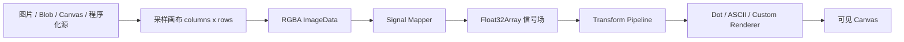

# MatrixEffect 组件开发设计文档

- 创建日期：2026-07-22
- 状态：需求已确认，待制定执行计划并实现
- 组件 ID：`matrix-effect`
- 主要导出：`MatrixEffect`、`DotMatrixEffect`、`AsciiEffect`

## 设计结论

本需求最终采用“一套采样场渲染核心 + 两个易用预设”的形态，而不是分别实现互不相干的圆点组件和 ASCII 组件。

核心数据流固定为：

```text
Source -> Rasterize / Sample -> Signal Mapper -> Transform Pipeline -> Renderer -> Canvas
```

最终约束如下：

1. 使用 Canvas 2D 作为首版唯一输出后端，不引入 Three.js、PixiJS 或其他图形依赖。
2. 一个 registry item 内同时交付通用核心、圆点预设和 ASCII 预设。
3. 支持静态图片、外部 Canvas 和程序化动态源；首版不支持视频、摄像头、音频和 DOM 截图。
4. 网格是响应式的 `columns x rows`，不会强制为 `n x n`。默认按画布比例、单元格宽高比和性能上限计算行列数。
5. 自定义能力位于数据源、整帧信号转换和渲染器三个层级；高频热路径使用 TypedArray，避免为每个格子创建 React 元素或长期对象。
6. 动态渲染默认采用自适应 30/60 FPS、DPR 上限、最大单元格数、页面隐藏暂停和离屏暂停。
7. 默认尊重 `prefers-reduced-motion`：静态内容正常绘制，动态源只绘制确定性的静止帧。
8. 首版不内置鼠标或触摸输入，也不监听 Pointer Events；该能力作为后续兼容性扩展记录。

这套设计和 Shader 的“采样输入、转换信号、输出像素/图元”思路相似，但首版有两个不适合直接锁定 GPU Shader 的需求：

- ASCII 需要字体测量和字符绘制。
- 用户需要直接传入 JavaScript/TypeScript 自定义函数。

因此首版定位为 CPU 侧的采样场渲染引擎。未来可以增加 WebGL 渲染后端，但 JavaScript 转换器不能自动转换为 GLSL，届时必须定义独立的 GPU 插件契约。

## 背景与需求理解

目标不是对原图逐像素原样绘制，而是先把输入抽象为一个低分辨率场，再让场中每个单元格的采样信息控制最终图元的参数。

以两个参考效果为例：

- 圆点效果：源场亮度越高，圆点半径和/或透明度越大；动态源可以是缓慢移动的柔和光团。
- ASCII 效果：源场亮度映射到按视觉密度排序的字符集，低亮度和高亮度分别选择不同字符。

这里的“源”不必始终是一张可见图片。程序化动态源可以在内部采样画布上绘制径向渐变、噪声、波纹或其他连续场，再复用相同的映射和渲染管线。

## 目标

- 提供一个可通过 QiuYe UI registry 安装的通用视觉矩阵组件。
- 用同一套核心能力覆盖静态与动态输入。
- 内置圆点矩阵和 ASCII 两种完整、可直接使用的预设。
- 允许调用方替换数据源、信号映射、转换链或最终渲染器。
- 在桌面和移动端保持响应式布局，不因画布比例变化拉伸单元格。
- 对动态效果提供可预期的调度、暂停、清理和降级行为。
- 对远程图片加载、Canvas 污染、零尺寸容器和自定义回调异常给出明确错误。
- 保持无新增 npm 依赖，registry 安装后只依赖 React 和浏览器 Canvas API。

## 非目标

首版明确不包含：

- WebGL、WebGPU、GLSL 或 WGSL Shader 执行。
- 视频文件、`HTMLVideoElement`、摄像头流或屏幕共享流。
- 麦克风、音频频谱或节拍响应。
- DOM 节点截图或任意 React 子树栅格化。
- 内置鼠标、触摸、压力、速度或手势输入。
- PNG/JPEG/GIF/视频导出、录制或下载按钮。
- 服务端 Canvas 渲染、SSR 图片生成或后端处理服务。
- 用大量 DOM 节点或文本节点呈现每个网格单元。
- 自动把 JavaScript 转换器编译为 GPU Shader。
- 首版自动接入首页组件墙；详情页和组件目录接入属于必做，首页展示可在验收后单独决定。

## 当前工程背景

### 技术与发布形态

当前仓库使用：

- Next.js 15 App Router。
- React 19。
- TypeScript 5，严格模式。
- Tailwind CSS 4。
- shadcn/ui registry 分发。
- `next.config.ts` 中使用 `output: "export"` 静态导出。

组件必须是客户端组件，但不能依赖服务端 API。组件详情页必须通过 `generateStaticParams()` 被静态生成；当前详情页已经根据 `componentRegistry` 自动生成参数。

### 已有能力与差异

- `components/qiuye-ui/dot-glass.tsx` 是 CSS mask + backdrop-filter 特效，不读取图像像素，也没有 Canvas 生命周期，不能作为本组件核心复用。
- 仓库没有 Canvas/WebGL/ASCII 渲染组件，也没有 Three.js、PixiJS 等图形依赖。
- 仓库已有 `ResizeObserver`、`requestAnimationFrame`、`prefers-reduced-motion` 等使用案例，可以沿用其客户端清理习惯，但本组件需要形成独立且完整的渲染调度器。
- `public/registry/code-block.json` 已证明一个 registry item 可以包含多个源码文件。
- `scripts/update-registry.mjs` 会回填每个 `files[].content` 并生成 `public/registry/registry.json`，后者不能手工修改。

### pnpm 约束

`pnpm-lock.yaml` 使用 `lockfileVersion: '6.0'`。实现和验证必须显式使用 pnpm 8.x，例如：

```bash
npx -y pnpm@8.7.0 update-registry
npx -y pnpm@8.7.0 update-registry:dry
npx -y pnpm@8.7.0 lint
npx -y pnpm@8.7.0 build
```

不能直接使用较新的全局 pnpm 更新 lockfile。本组件计划不增加 npm 依赖，因此正常实现不应修改 `package.json` 或 `pnpm-lock.yaml`。

## 组件命名与交付形态

### Registry 身份

```text
组件 ID / cliName: matrix-effect
组件名称: Matrix Effect
分类: 特效
版本起点: 1.0.0
```

建议标签：

```text
canvas, matrix, grid, visual-effect, animation, dots, ascii, image,
procedural, sampling, generative, responsive
```

### 对外导出

```tsx
import {
  MatrixEffect,
  DotMatrixEffect,
  AsciiEffect,
  createSoftBlobSource,
  createLuminanceMapper,
  createLevelsTransform,
  createInvertTransform,
  createThresholdTransform,
  createTemporalSmoothingTransform,
  createDotRenderer,
  createAsciiRenderer,
  createCellRenderer,
} from "@/components/qiuye-ui/matrix-effect";
```

使用者只想获得参考效果时使用预设；需要自定义管线时再使用核心和工厂函数。

### 计划文件结构

```text
components/qiuye-ui/matrix-effect/
  index.ts
  matrix-effect.tsx
  sources.ts
  transforms.ts
  renderers.ts
  presets.tsx
  types.ts

components/qiuye-ui/demos/
  matrix-effect-demo.tsx
```

模块职责：

| 文件 | 职责 |
| --- | --- |
| `types.ts` | 公共类型、Source/Frame/Renderer/Props 契约 |
| `matrix-effect.tsx` | React 生命周期、尺寸观测、调度、采样画布和核心管线 |
| `sources.ts` | 图片、Canvas、程序化源的规范化与 `createSoftBlobSource` |
| `transforms.ts` | 亮度映射、反相、Levels、阈值、时间平滑 |
| `renderers.ts` | 圆点、ASCII 和自定义单元格渲染器工厂 |
| `presets.tsx` | `DotMatrixEffect`、`AsciiEffect` 易用封装 |
| `index.ts` | 稳定公共导出入口 |

所有文件都属于同一个 `matrix-effect` registry item。组件源码只允许引用同一目录文件、React 和 `@/lib/utils`；若后续引入其他仓库本地文件，必须同步加入 registry `files[]`。

## 总体架构



### 为什么需要内部采样画布

所有栅格输入先绘制到一个仅有 `columns x rows` 像素的内部 Canvas。每个采样像素对应最终一个逻辑单元格，随后只需读取一次 `ImageData`。

优点：

- 大图不会按原始分辨率参与每帧计算。
- 图片、外部 Canvas 和程序化绘制共享同一条管线。
- 浏览器缩放和 `imageSmoothingEnabled` 可以完成首轮降采样。
- 100 x 100 网格只需要读取约 40 KB RGBA 数据，而不是整张全屏图片。

内部采样 Canvas 不挂载到 DOM。首版内部仍使用普通 `HTMLCanvasElement`，不强制使用 `OffscreenCanvas`，以保持 Safari 和静态站点兼容性。

### 单帧流程

1. 根据可见画布 CSS 尺寸计算 `columns`、`rows`、单元格宽高和有效 DPR。
2. 把当前 Source 绘制到 `columns x rows` 的内部采样 Canvas。
3. 调用 `getImageData()` 读取 RGBA；读取上下文使用 `{ willReadFrequently: true }` 提示。
4. Signal Mapper 把 RGBA 转换为主信号 `values: Float32Array`。
5. 按数组顺序执行 Transform Pipeline；转换器可以读取完整网格和上一帧结果。
6. 把非有限值归零，并把最终主信号限制到 `[0, 1]`。
7. Renderer 根据 RGBA、主信号和单元格几何信息绘制可见 Canvas。
8. 当前最终信号写入上一帧缓冲区，供下一帧的时间平滑或自定义算法使用。

网格、信号和上一帧 TypedArray 只在分辨率变化时重新分配。`getImageData()` 产生的 `ImageData` 分配属于 Canvas 2D API 的必要成本，不额外复制其 RGBA 数组。

## Source 设计

### 公共类型

```tsx
export type MatrixFit = "cover" | "contain" | "fill";

export interface MatrixSourcePosition {
  /** 水平位置，0 为左侧，0.5 为居中，1 为右侧 */
  x: number;
  /** 垂直位置，0 为顶部，0.5 为居中，1 为底部 */
  y: number;
}

export type MatrixImageInput =
  | string
  | Blob
  | HTMLImageElement
  | ImageBitmap;

export interface MatrixImageSource {
  type: "image";
  src: MatrixImageInput;
  fit?: MatrixFit;
  position?: MatrixSourcePosition;
  smoothing?: boolean;
  background?: string | null;
  crossOrigin?: "anonymous" | "use-credentials";
}

export interface MatrixCanvasSource {
  type: "canvas";
  canvas:
    | HTMLCanvasElement
    | OffscreenCanvas
    | (() => HTMLCanvasElement | OffscreenCanvas | null);
  animated?: boolean;
  fit?: MatrixFit;
  position?: MatrixSourcePosition;
  smoothing?: boolean;
  background?: string | null;
}

export interface MatrixProceduralContext {
  ctx: CanvasRenderingContext2D;
  width: number;
  height: number;
  columns: number;
  rows: number;
  time: number;
  deltaTime: number;
  frame: number;
}

export interface MatrixProceduralSource {
  type: "procedural";
  draw: (context: MatrixProceduralContext) => void;
  animated?: boolean;
  background?: string | null;
}

export type MatrixSource =
  | MatrixImageSource
  | MatrixCanvasSource
  | MatrixProceduralSource;
```

`File` 继承自 `Blob`，无需单独加入联合类型。

### 默认行为

- 图片源默认为静态，加载和首次绘制成功后停止帧循环。
- Canvas 源的 `animated` 默认为 `false`；外部 Canvas 持续更新时必须显式设为 `true`。
- 程序化源的 `animated` 默认为 `true`。
- `fit` 默认为 `cover`，`position` 默认为 `{ x: 0.5, y: 0.5 }`。
- `smoothing` 默认为 `true`。
- `background` 默认为透明。

### 程序化柔和光团源

`createSoftBlobSource()` 返回 `MatrixProceduralSource`，使用多个低分辨率径向渐变生成连续灰度场，不需要在可见画布上执行大面积 CSS blur。

```tsx
export interface SoftBlobSourceOptions {
  count?: number;
  minRadius?: number;
  maxRadius?: number;
  speed?: number;
  baseValue?: number;
  seed?: number;
}

export function createSoftBlobSource(
  options?: SoftBlobSourceOptions,
): MatrixProceduralSource;
```

- `count` 首版限制在合理范围内，例如 1 到 6。
- 半径使用相对短边的归一化比例。
- 轨迹由固定 seed、相位不同的正弦组合生成，相同参数在时间 `0` 必须得到相同画面。
- 减少动态效果模式使用时间 `0` 的静止帧。
- 首版没有鼠标吸引、排斥或跟随逻辑。

### 资源所有权

- 组件内部为字符串 URL 或 Blob 创建的 `Image`、object URL 和监听器由组件清理。
- 调用方传入的 `HTMLImageElement`、`ImageBitmap`、Canvas 不归组件所有；组件卸载时不得调用外部资源的 `close()` 或移除外部节点。
- Source 变化时使用版本令牌或 AbortController 忽略过期加载结果，避免慢图片覆盖新图片。
- 开发环境 React Strict Mode 重复挂载时，初始化和清理必须幂等。

## 响应式网格设计

### Grid 配置

```tsx
export type MatrixGridConfig =
  | {
      mode?: "auto";
      /** 目标单元格宽度，CSS px */
      cellSize?: number;
      /** 单元格宽 / 高；圆点通常为 1，ASCII 默认约为 0.6 */
      cellAspectRatio?: number;
      maxCells?: number;
    }
  | {
      mode: "fixed";
      columns: number;
      /** 不传时根据画布比例和 cellAspectRatio 推导 */
      rows?: number;
      cellAspectRatio?: number;
      maxCells?: number;
    };
```

### 计算规则

优先级：

```text
grid.cellAspectRatio > renderer.cellAspectRatio > 1
```

自动模式中，`cellSize` 表示目标单元格宽度。单元格高度为：

```text
cellHeight = cellSize / cellAspectRatio
```

固定列数但未指定行数时：

```text
rows = round(columns * cellAspectRatio * canvasHeight / canvasWidth)
```

因此 2:1 的横向画布、100 列、正方形单元格会得到约 50 行，而不是强制 100 行。

如果计算结果超过 `maxCells`，按相同比例缩小行列数，保持画布比例和单元格宽高比。不能只截断最后若干单元格。

默认值：

| 场景 | cellSize | cellAspectRatio | maxCells |
| --- | ---: | ---: | ---: |
| 核心默认 | 10 | 取 renderer 提示，否则 1 | 10000 |
| DotMatrixEffect | 10 | 1 | 10000 |
| AsciiEffect | 10 | 0.6 | 6000 |

调用方需要严格的 100 x 100 时可以显式配置：

```tsx
grid={{ mode: "fixed", columns: 100, rows: 100, maxCells: 10000 }}
```

固定模式也必须受 `maxCells` 保护。非法、负数或非有限配置回退到默认值，并在开发环境输出一次警告。

## 帧数据、映射与转换

### 公共帧类型

```tsx
export interface MatrixFrame {
  readonly columns: number;
  readonly rows: number;
  readonly rgba: Uint8ClampedArray;
  /** 当前主信号；Mapper 和 Transform 可以原地写入 */
  readonly values: Float32Array;
  /** 上一个成功绘制帧的最终信号；首帧或重置后为 null */
  readonly previousValues: Float32Array | null;
}

export interface MatrixFrameContext {
  /** 动画有效时间，秒；暂停期间不累计 */
  readonly time: number;
  /** 与上一个已绘制帧的间隔，秒，并限制异常大值 */
  readonly deltaTime: number;
  readonly frame: number;
  readonly cssWidth: number;
  readonly cssHeight: number;
  readonly cellWidth: number;
  readonly cellHeight: number;
  readonly dpr: number;
}

export type MatrixSignalMapper = (
  frame: MatrixFrame,
  context: MatrixFrameContext,
) => void;

export type MatrixSignalTransform = (
  frame: MatrixFrame,
  context: MatrixFrameContext,
) => void;
```

`values[index]` 与 `rgba[index * 4 ... index * 4 + 3]` 对应同一个单元格。行列计算为：

```text
row = floor(index / columns)
column = index % columns
```

自定义转换器因此可以访问上下左右邻居、整张场和上一帧，不会被限制为只能处理孤立单元格。

### 默认亮度 Mapper

`createLuminanceMapper()` 使用 Rec.709 权重的视觉亮度近似：

```text
value = (0.2126 * R + 0.7152 * G + 0.0722 * B) / 255
```

Alpha 不直接混入主信号，保留在 RGBA 中由内置 Renderer 作为覆盖率处理。这样执行反相时，透明区域不会意外变为完全可见。

### 内置转换器

首版提供：

```tsx
createLuminanceMapper(options?)
createInvertTransform()
createLevelsTransform({ inputMin, inputMax, brightness, contrast, gamma })
createThresholdTransform({ threshold, softness })
createTemporalSmoothingTransform({ responseMs })
```

语义：

- Invert：`value = 1 - value`。
- Levels：裁切输入范围，再应用亮度、对比度和 Gamma。
- Threshold：`softness = 0` 为硬阈值，大于 0 时使用平滑过渡。
- Temporal smoothing：根据 `deltaTime` 和 `responseMs` 做时间无关的指数逼近，不使用固定每帧系数。

转换器按数组顺序执行。核心只在全部转换结束后统一处理 `NaN`、`Infinity` 和 `[0, 1]` 限制，避免每个转换器重复扫描。

首版只有一个标准主信号通道。原始 RGBA 始终保留，因此 Renderer 仍可使用原图颜色。多命名数值通道作为未来扩展，不在首版引入通道注册表和额外内存管理。

## Renderer 设计

### 高性能整帧契约

```tsx
export interface MatrixRenderer {
  readonly cellAspectRatio?: number;
  readonly preferredFrameRate?: 30 | 60;
  prepare?(
    ctx: CanvasRenderingContext2D,
    frame: MatrixFrame,
    context: MatrixFrameContext,
  ): void;
  render(
    ctx: CanvasRenderingContext2D,
    frame: MatrixFrame,
    context: MatrixFrameContext,
  ): void;
  dispose?(): void;
}
```

Renderer 负责遍历网格并决定最终图元，不允许触发 React setState。`prepare()` 只在 Canvas、网格、DPR 或 Renderer 身份变化时调用，适合缓存字体指标或 Path 资源。

### 自定义单元格便利适配器

`createCellRenderer(drawCell)` 为简单自定义效果提供易用入口：

```tsx
export interface MatrixRenderCell {
  index: number;
  column: number;
  row: number;
  x: number;
  y: number;
  centerX: number;
  centerY: number;
  width: number;
  height: number;
  u: number;
  v: number;
  value: number;
  r: number;
  g: number;
  b: number;
  a: number;
}

export function createCellRenderer(
  drawCell: (
    ctx: CanvasRenderingContext2D,
    cell: MatrixRenderCell,
    context: MatrixFrameContext,
  ) => void,
  options?: {
    cellAspectRatio?: number;
    preferredFrameRate?: 30 | 60;
  },
): MatrixRenderer;
```

这是便利 API，不是最高性能 API。高密度动态效果应实现整帧 `MatrixRenderer`，以便批量 Path、减少状态切换并避免逐格对象分配。

### 圆点 Renderer

`createDotRenderer()` 支持：

- 主信号控制半径。
- 固定颜色或源图颜色。
- 独立的半径范围和透明度范围。
- 源 Alpha 覆盖率。
- 可选的值曲线。

内置单色圆点模式应把同色圆点尽量合并到一个 Path 后统一 `fill()`，不能为每个圆点单独 `beginPath()` + `fill()`。源图着色模式允许按单元格绘制，但默认降低性能预期。

### ASCII Renderer

`createAsciiRenderer()` 支持：

- 自定义字符字符串或字符数组。
- 字符按从低视觉密度到高视觉密度排列。
- 固定颜色或源图颜色。
- 自定义等宽字体、字重和字号缩放比例。
- 可选输出背景色。
- 透明/低值单元格跳过绘制。

默认字符集：

```text
 .:-=+*#%@
```

字符索引：

```text
glyphIndex = round(value * (glyphCount - 1))
```

默认使用跨平台等宽字体栈。ASCII 的默认 `cellAspectRatio` 为约 `0.6`，允许调用方覆盖。首版不依赖 DOM 文本测量；Renderer 可以在 `prepare()` 中通过 `measureText("M")` 修正内部对齐，但不能在每个单元格重复测量。

单色 ASCII 可以缓存字体、字符索引和必要的字形资源。动态源色 ASCII 属于高成本模式，默认受 6000 单元格和 30 FPS 限制。

## MatrixEffect 核心 API

```tsx
export type MatrixFrameRate = "auto" | 30 | 60;
export type MatrixReducedMotion = "freeze" | "ignore";
export type MatrixEffectStatus = "idle" | "loading" | "ready" | "error";

export interface MatrixEffectError {
  code:
    | "SOURCE_LOAD_FAILED"
    | "SOURCE_SECURITY_ERROR"
    | "CANVAS_CONTEXT_UNAVAILABLE"
    | "SOURCE_RUNTIME_ERROR"
    | "MAPPER_RUNTIME_ERROR"
    | "TRANSFORM_RUNTIME_ERROR"
    | "RENDERER_RUNTIME_ERROR";
  message: string;
  recoverable: boolean;
  cause?: unknown;
}

export interface MatrixEffectHandle {
  readonly canvas: HTMLCanvasElement | null;
  /** 请求重绘一帧，适合 animated=false 的外部 Canvas 更新 */
  invalidate(): void;
}

export interface MatrixEffectProps
  extends Omit<React.HTMLAttributes<HTMLDivElement>, "children" | "onError"> {
  source: MatrixSource;
  renderer: MatrixRenderer;
  mapper?: MatrixSignalMapper;
  transforms?: readonly MatrixSignalTransform[];
  grid?: MatrixGridConfig;
  playing?: boolean;
  frameRate?: MatrixFrameRate;
  maxDpr?: number;
  pauseWhenOffscreen?: boolean;
  reducedMotion?: MatrixReducedMotion;
  clearColor?: string | null;
  canvasClassName?: string;
  decorative?: boolean;
  ariaLabel?: string;
  fallback?: React.ReactNode;
  onStatusChange?: (status: MatrixEffectStatus) => void;
  onReady?: () => void;
  onError?: (error: MatrixEffectError) => void;
}
```

默认值：

| Prop | 默认值 |
| --- | --- |
| `mapper` | `createLuminanceMapper()` |
| `transforms` | `[]` |
| `grid` | auto、10px、renderer 宽高比、10000 cells |
| `playing` | `true` |
| `frameRate` | `"auto"` |
| `maxDpr` | `2` |
| `pauseWhenOffscreen` | `true` |
| `reducedMotion` | `"freeze"` |
| `clearColor` | `null`，透明 |
| `decorative` | `true` |

根节点负责尺寸和布局，可通过 `className`、`style` 设置宽高或 `aspect-ratio`。组件不会凭空决定固定高度；零尺寸时保持 `idle` 并等待 ResizeObserver，不视为错误。

`fallback` 在 `status="error"` 且尚无成功绘制帧时显示。若组件此前已有成功画面，运行时错误默认保留最后一帧而不以 fallback 覆盖。图片加载期间默认保持透明画布，不内置 Spinner。

Source、Renderer 或函数回调身份变化会使管线失效并重建必要缓存。调用方传入复杂对象或函数时应使用 `useMemo` / `useCallback` 保持稳定身份。

## 预设组件 API

### DotMatrixEffect

```tsx
export interface DotMatrixEffectProps
  extends Omit<
    MatrixEffectProps,
    "source" | "renderer" | "mapper" | "transforms"
  > {
  source?: MatrixSource;
  blobOptions?: SoftBlobSourceOptions;
  color?: string | "source";
  /** CSS px，内部会限制到单元格可容纳范围 */
  radiusRange?: readonly [number, number];
  opacityRange?: readonly [number, number];
  invert?: boolean;
  levels?: {
    inputMin?: number;
    inputMax?: number;
    brightness?: number;
    contrast?: number;
    gamma?: number;
  };
  additionalTransforms?: readonly MatrixSignalTransform[];
}
```

未传 `source` 时自动使用 `createSoftBlobSource(blobOptions)`，因此以下代码直接得到动态柔和光团控制圆点的效果：

```tsx
<DotMatrixEffect
  className="aspect-square w-full"
  color="#a1a1aa"
  radiusRange={[0.2, 3.2]}
/>
```

预设内置转换顺序：

```text
Luminance -> optional Invert -> optional Levels -> additionalTransforms
```

### AsciiEffect

```tsx
export interface AsciiEffectProps
  extends Omit<
    MatrixEffectProps,
    "source" | "renderer" | "mapper" | "transforms" | "clearColor"
  > {
  source: MatrixSource;
  characters?: string | readonly string[];
  colorMode?: "fixed" | "source";
  color?: string;
  backgroundColor?: string | null;
  fontFamily?: string;
  fontWeight?: number | string;
  fontScale?: number;
  invert?: boolean;
  levels?: {
    inputMin?: number;
    inputMax?: number;
    brightness?: number;
    contrast?: number;
    gamma?: number;
  };
  additionalTransforms?: readonly MatrixSignalTransform[];
}
```

基础用法：

```tsx
<AsciiEffect
  source={{
    type: "image",
    src: "/examples/matrix-effect/source.webp",
    fit: "contain",
  }}
  characters=" .:=+*#%@"
  colorMode="fixed"
  color="#71717a"
  decorative={false}
  ariaLabel="由字符组成的示例图像"
  className="aspect-square w-full"
/>
```

预设内置转换顺序与 Dot 一致。`backgroundColor` 映射为输出 Canvas 的清屏颜色，不影响 Source 的 `background`。

### 高级核心用法

```tsx
const source = React.useMemo(
  () => ({
    type: "procedural" as const,
    animated: true,
    draw: ({ ctx, width, height, time }) => {
      // 在低分辨率采样画布中绘制自定义动态场
    },
  }),
  [],
);

const renderer = React.useMemo(
  () =>
    createCellRenderer((ctx, cell) => {
      const size = cell.value * Math.min(cell.width, cell.height);
      ctx.fillRect(cell.centerX - size / 2, cell.centerY - size / 2, size, size);
    }),
  [],
);

return <MatrixEffect source={source} renderer={renderer} />;
```

## Canvas 尺寸与 DPR

可见 Canvas 的 CSS 尺寸来自根容器。实际 backing store：

```text
effectiveDpr = min(window.devicePixelRatio, maxDpr)
canvas.width = round(cssWidth * effectiveDpr)
canvas.height = round(cssHeight * effectiveDpr)
```

除 `maxDpr` 外，内部还应限制最大 backing-store 像素总量，例如约 4M 像素。超出时继续降低有效 DPR，而不是创建可能导致内存峰值的超大 Canvas。

Renderer 使用 CSS 像素坐标；核心在每帧开始前重置 transform 并统一应用 DPR scale。不能在多帧中累积 `scale()`。

ResizeObserver 触发时：

1. 对 CSS 尺寸取合理精度，避免亚像素抖动造成反复重建。
2. 重新计算 backing store 和网格。
3. 仅在列数或行数变化时重建信号缓冲。
4. 清空上一帧缓冲，避免不同分辨率之间错误平滑。
5. 静态源也重绘一次。

缺少 ResizeObserver 时，降级为首次测量加 `window.resize` 监听；缺少 IntersectionObserver 时，只取消离屏暂停能力，不影响绘制。

## 动画调度与暂停

### 静态和动态模式

- 静态图片、`animated=false` Canvas 或程序化源：只在加载完成、尺寸变化、配置变化或 `invalidate()` 时绘制。
- `animated=true` Source：使用单一 `requestAnimationFrame` 循环。
- 组件内部不能使用 React state 驱动每一帧；React state 只用于 `status` 这类低频状态。

### 自适应帧率

`frameRate=30` 或 `60` 时按固定上限跳帧；`"auto"` 时：

- Dot Renderer 首选 60 FPS。
- ASCII Renderer 首选 30 FPS。
- 自定义 Renderer 使用其 `preferredFrameRate`，未声明时首选 60 FPS。
- 60 FPS 模式出现持续的渲染超预算或连续丢帧时降到 30 FPS。
- 恢复到 60 FPS 必须经过更长的稳定窗口和冷却时间，避免在 30/60 之间抖动。
- 自动模式只调整帧率，不在动画中突然改变网格分辨率，以免画面出现明显跳变。

具体性能采样可以使用渲染耗时的指数移动平均值和 rAF 间隔。阈值属于实现细节，但必须有降级滞后和升级冷却。

### 时间语义

- `time` 使用组件有效播放时间，而不是页面绝对时间。
- 页面隐藏、离屏或手动 `playing=false` 时不累计有效时间。
- 恢复后的首帧重置时间基准，不允许出现数秒级 `deltaTime` 导致光团跳跃。
- `deltaTime` 设置最大值，例如 0.1 秒，防止短暂调度阻塞放大物理变化。

### 暂停条件

动态循环在以下任一条件下暂停：

- `playing=false`。
- `document.visibilityState !== "visible"`。
- `pauseWhenOffscreen=true` 且 IntersectionObserver 判断组件离开视口。
- `prefers-reduced-motion: reduce` 且 `reducedMotion="freeze"`。
- 组件宽高为 0。
- 发生未恢复的运行时错误。

离屏观测可使用少量 root margin，避免组件刚进入视口时才开始准备。暂停时必须取消 rAF，而不是继续每帧执行后直接 return。

## 减少动态效果与可访问性

### Reduced Motion

默认 `reducedMotion="freeze"`：

- 静态图片和静态 Canvas 正常绘制。
- 动态程序化 Source 使用时间 `0` 绘制一帧后停止。
- 不把整个 Canvas 隐藏，避免丢失仍有视觉意义的内容。

只有明确需要且不造成可访问性问题时，调用方才能设置 `reducedMotion="ignore"`。

### Canvas 语义

视觉特效默认是装饰性的：

```text
decorative=true -> canvas aria-hidden=true
```

如果 ASCII 图像承载内容：

```text
decorative=false -> canvas role=img，并要求 ariaLabel
```

开发环境中 `decorative=false` 但缺少 `ariaLabel` 时输出一次警告。Canvas 不可用或发生错误时，调用方可以通过 `fallback` 提供静态图片或替代文本。

首版没有键盘、焦点或指针交互，因此 Canvas 本身不进入 Tab 顺序。

## 颜色与主题行为

Canvas 是即时栅格输出，绘制后的颜色不会像 DOM CSS 一样自动随主题变量更新。

首版规则：

- 内置预设接受普通 CSS 颜色字符串或源图颜色。
- 默认圆点颜色使用明确的中性色，不依赖 `next-themes`。
- Demo 如需随深浅主题变化，应读取当前主题并传入新的 `color` / `backgroundColor`，让 Renderer 身份或配置变化触发重绘。
- 调用方也可以在主题变化后调用 `ref.current.invalidate()`。
- 首版不解析任意 `var(--token)` 字符串，也不在组件内部依赖 `next-themes`。

## 错误处理

### 图片加载与 CORS

Canvas 一旦绘制了不允许跨域读取的图片，`getImageData()` 会抛出 `SecurityError`。组件不能绕过浏览器安全模型。

规则：

- 远程 URL 默认使用调用方配置的 `crossOrigin`；Demo 优先使用同源本地资产。
- 远程服务器必须返回合适的 `Access-Control-Allow-Origin`。
- 已经加载的外部 `HTMLImageElement` 是否安全由调用方来源决定。
- 捕获到安全错误时上报 `SOURCE_SECURITY_ERROR`，停止循环，并说明需要同源或 CORS 资源。
- 不增加服务端图片代理作为兜底。

### 运行时异常

Source、Mapper、Transform、Renderer 的异常分别映射到不同错误 code。单次配置发生错误后：

1. 停止当前帧循环，防止每帧重复抛错和调用 `onError`。
2. 保留最近一次成功画面；若没有成功画面则使用 clearColor 或透明。
3. `status` 进入 `error`。
4. Source 或管线配置变化时自动重试。

错误回调本身的异常不能再次进入渲染循环。

### 边界输入

- 宽高为 0：等待尺寸，不报错。
- 图片尚未完成加载：状态为 `loading`。
- 外部 Canvas supplier 返回 null：保持 idle，并在 `invalidate()` 或下一次动态帧重试；不每帧打印警告。
- 字符集为空：回退默认字符集并开发期警告。
- 只有一个字符：所有有效单元格使用该字符。
- `inputMin >= inputMax`、负半径、非法 Gamma：规范化到安全值并开发期警告。
- 自定义 Transform 写入非有限值：最终统一转换为 0。

## 性能预算与实现约束

### 默认预算

| 项目 | Dot | ASCII |
| --- | ---: | ---: |
| 默认最大单元格数 | 10000 | 6000 |
| 自动模式首选 FPS | 60 | 30 |
| 默认最大 DPR | 2 | 2 |
| 离屏暂停 | 是 | 是 |
| 页面隐藏暂停 | 是 | 是 |
| Reduced Motion 静止帧 | 是 | 是 |

这些是默认保护值，不是对所有硬件的绝对帧率承诺。验收重点是组件能在压力下稳定降到 30 FPS，不持续占用不可见页面资源，也不造成 React 每帧提交。

### 不得违反的热路径规则

- 不为每个单元格创建 DOM/React 节点。
- 不在每帧 setState。
- 不在每帧重建采样 Canvas、TypedArray、字体配置或 Renderer。
- 不在 ASCII 的每个格子中调用 `measureText()`。
- 不在 Dot 单色模式中逐点独立 `fill()`。
- 不在配置未变化时重复加载图片或创建 object URL。
- 不在暂停状态保留活动 rAF。
- 不把完整高分辨率源图做 `getImageData()`；只读取网格分辨率采样画布。

### 性能观测

开发 Demo 可以展示实际 `columns x rows` 和当前目标 FPS，但核心不应提供高频 React `onFrame` 回调。若需要调试指标，优先通过仅开发环境的内部统计或低频回调后续扩展，避免测量能力本身成为性能问题。

## Demo 与用户可见行为

完整 Demo 至少包含三个场景。

### 1. 柔和光团圆点矩阵

- 使用默认 `DotMatrixEffect` 和 `createSoftBlobSource()`。
- 浅色背景、中性圆点，视觉方向贴近参考图一。
- 光团缓慢、连续移动，不使用突变随机数。
- 可调整网格密度、半径范围、速度、对比度和反相。
- Reduced Motion 下显示构图完整的静止帧。

### 2. 静态图片转 ASCII

- 使用同源本地示例图片，避免线上 Demo 因 CORS 失效。
- 使用 `fit="contain"` 保留完整主体。
- 可切换固定色/源图色、字符集、反相和采样密度。
- 默认静态图片只绘制一次。
- 视觉方向贴近参考图二，但不要求复制参考图片本身。

### 3. 自定义管线

- 使用 `MatrixEffect` + 自定义 Transform 或 `createCellRenderer()`。
- 示例应明显展示“同一 Source、更换映射/绘制逻辑即可得到新效果”。
- 示例代码保持短小，避免把完整引擎逻辑复制到 Demo。

详情页快速预览使用 `DotMatrixEffect`，尺寸稳定且无需网络资源。完整 Demo 的容器必须设置稳定高度或 `aspect-ratio`，避免 Canvas 加载和动态内容造成布局跳动。

## 仓库接入设计

实现阶段需要同步以下位置：

1. `components/qiuye-ui/matrix-effect/*`：核心、多文件模块和公共导出。
2. `components/qiuye-ui/demos/matrix-effect-demo.tsx`：完整 Demo。
3. `app/components/[id]/simple-demos.tsx`：新增 `MatrixEffectSimpleDemo`。
4. `app/components/[id]/page.tsx`：导入 Demo 和简单 Demo，加入两个映射。
5. `lib/component-constants.ts`：新增 `MATRIX_EFFECT = "matrix-effect"` 和基础用法。
6. `lib/registry.ts`：新增 `Matrix Effect` 元信息；因为有三个主要组件，使用 `propsInfo`。
7. `public/registry/matrix-effect.json`：列出目录内全部交付文件。
8. `packages/qiuye-ui-cli/bin/qiuye-ui-mcp.mjs`：把 `matrix-effect` 加入 `DEFAULT_COMPONENT_NAMES` fallback。
9. `README.md`、`AGENT.md` 等真实组件清单：补充新组件。
10. 运行 `npx -y pnpm@8.7.0 update-registry` 生成 content 和 registry 清单。

当前 `app/cli/page.tsx` 的组件数据来自 `getAllComponents()`，并非固定“全部组件 ID”数组。新增 registry 元数据后可自动出现在相关列表中，因此除非要把 Matrix Effect 放入首页优先推荐位，否则不需要为了组件 ID 手工修改该页面。

`lib/registry.ts` 中的文件元信息固定为：

```tsx
files: {
  component: "components/qiuye-ui/matrix-effect/index.ts",
  demo: "components/qiuye-ui/demos/matrix-effect-demo.tsx",
  types: "components/qiuye-ui/matrix-effect/types.ts",
}
```

建议 registry item：

```json
{
  "$schema": "https://ui.shadcn.com/schema/registry-item.json",
  "name": "matrix-effect",
  "title": "MatrixEffect",
  "type": "registry:component",
  "author": "QiuYeDx <me@qiuyedx.com>",
  "dependencies": [],
  "registryDependencies": [],
  "files": [
    {
      "type": "registry:component",
      "path": "components/qiuye-ui/matrix-effect/index.ts"
    },
    {
      "type": "registry:component",
      "path": "components/qiuye-ui/matrix-effect/matrix-effect.tsx"
    },
    {
      "type": "registry:component",
      "path": "components/qiuye-ui/matrix-effect/sources.ts"
    },
    {
      "type": "registry:component",
      "path": "components/qiuye-ui/matrix-effect/transforms.ts"
    },
    {
      "type": "registry:component",
      "path": "components/qiuye-ui/matrix-effect/renderers.ts"
    },
    {
      "type": "registry:component",
      "path": "components/qiuye-ui/matrix-effect/presets.tsx"
    },
    {
      "type": "registry:component",
      "path": "components/qiuye-ui/matrix-effect/types.ts"
    }
  ]
}
```

`public/registry/registry.json` 只能由脚本生成，不能手改。Demo 文件不随组件 registry 安装，无需放入 item 的 `files[]`。

## 浏览器兼容与静态导出

最低依赖能力：

- Canvas 2D、`drawImage()`、`getImageData()`。
- `requestAnimationFrame`。
- `matchMedia`。
- 可选增强：ResizeObserver、IntersectionObserver、ImageBitmap、OffscreenCanvas 输入。

组件文件顶部使用 `"use client"`。任何 `window`、`document`、`HTMLImageElement`、`matchMedia` 和 Observer 访问必须位于 effect、事件或带 `typeof` 保护的客户端路径中，不能在模块初始化或服务端预渲染阶段直接执行。

静态导出构建期间只输出 Canvas 容器标记，不加载图片和启动动画；客户端 hydration 后初始化。

## 安全与资源限制

- 不使用 `eval`、动态脚本或用户提供的 Shader 字符串。
- ASCII 字符通过 Canvas `fillText()` 绘制，不插入 HTML。
- 自定义函数本身属于调用方受信代码，组件只负责捕获和隔离其运行时异常。
- 远程图片遵循浏览器 CORS，不代理或绕过权限。
- 默认 `maxCells` 和 backing-store 像素上限用于降低误配置导致页面冻结的风险。
- 调用方可以显式提高 `maxCells`，但开发环境应对明显过大的配置发出一次警告。
- Blob object URL、事件监听、Observer、rAF 和内部 Canvas 引用在 Source 变化或卸载时全部清理。

## 后续版本可扩展点

### 指针与触摸输入

首版不监听任何鼠标或触摸事件。后续如果出现明确交互场景，可以增加可选 Pointer Events 输入层：

```tsx
export interface MatrixPointerState {
  x: number;
  y: number;
  velocityX: number;
  velocityY: number;
  pressure: number;
  active: boolean;
  pressed: boolean;
}
```

可扩展效果包括：

- 指针附近圆点放大、缩小、吸引或排斥。
- 移动速度驱动波纹和拖尾。
- ASCII 在指针附近恢复清晰度、密度或原图颜色。
- 触摸按压产生扩散场，松开后按时间衰减。

未来需要同时解决：

- 监听目标是 Canvas、window 还是外部元素。
- 装饰性全屏 Canvas 如何保持 `pointer-events: none` 和底层点击穿透。
- 多点触控、离开画布、按压取消和压力缺失的降级。
- Reduced Motion 下是否禁用跟随和波纹。

向 `MatrixFrameContext` 添加可选 `pointer` 字段属于向后兼容的类型扩展，因此首版无需提前安装事件监听器或暴露无实际行为的 Props。

### 其他扩展

- WebGL Renderer：面向更高单元格数和全屏 60 FPS，但使用独立 GPU 插件契约。
- 视频/摄像头：增加媒体生命周期、自动播放权限和跨域处理。
- 音频输入：把频谱或节拍转为一个或多个信号场。
- OffscreenCanvas + Worker：降低主线程压力，但自定义回调需要可传输/可序列化边界。
- 多信号通道：除主 `value` 外提供 angle、velocity、depth 等命名 TypedArray。
- 输出捕获：`toBlob()`、静态图片导出或录制。
- 更多 Renderer：线段、方块、十字、图标 atlas、粒子实例。

这些扩展不能提前污染首版 API；只有在出现真实用例后再增加。

## 风险与应对

| 风险 | 影响 | 应对 |
| --- | --- | --- |
| 10000 个图元在低端移动设备上超预算 | 掉帧、耗电 | 自动降至 30 FPS、maxCells、离屏和隐藏暂停 |
| 动态 ASCII 大量 `fillText` | CPU 占用高 | 默认 6000 cells / 30 FPS、跳过空字符、缓存字体指标 |
| 远程图片污染 Canvas | 无法读取像素 | 同源 Demo、明确 crossOrigin、结构化安全错误 |
| 响应式容器尺寸频繁抖动 | 反复分配和闪烁 | 尺寸取整、只在网格变化时重建缓冲 |
| Source/Renderer 每次 React render 都换身份 | 重置动画和缓存 | 文档要求 useMemo/useCallback，内部缩小失效范围 |
| React Strict Mode 双 effect | 重复 rAF/监听 | 幂等初始化、统一 cleanup、版本令牌 |
| 页面恢复后 deltaTime 过大 | 动画跳跃 | 暂停不累计时间、恢复重置基准、限制 deltaTime |
| Canvas 颜色不自动响应主题 | 静态帧颜色过期 | 主题变化传新颜色或调用 invalidate，Demo 显式处理 |
| 自定义回调无限耗时 | 主线程阻塞 | 默认单元格限制、错误隔离；无法抢占同步用户代码需文档说明 |
| 过度抽象导致简单用法复杂 | 使用门槛高 | Dot/ASCII 预设覆盖常见用法，核心 API 面向高级用户 |

## 验证与验收方案

### 静态检查

```bash
npx -y pnpm@8.7.0 update-registry
npx -y pnpm@8.7.0 update-registry:dry
npx -y pnpm@8.7.0 lint
npx -y pnpm@8.7.0 build
```

验收：

- lockfile 仍为 v6，且本功能没有引入依赖变动。
- registry dry run 不再报告 `matrix-effect` 源码 content 不同步。
- 静态导出包含 `/components/matrix-effect/`。
- registry JSON 能安装全部目录文件，`index.ts` 导出无缺失。

### 功能验证

- 静态图片首次加载后只绘制一帧；Resize 或 invalidate 会重绘。
- 动态光团连续运行，暂停和恢复无时间跳跃。
- 外部动态 Canvas 能持续采样；静态 Canvas 可通过 invalidate 更新。
- 自定义 Mapper 可以读取 RGB，自定义 Transform 可以访问邻居和上一帧。
- Dot 半径和 ASCII 字符都随输入信号正确变化。
- `invert`、Levels、阈值和时间平滑顺序符合文档。
- 图片 `cover`、`contain`、`fill` 和 position 正确。
- 远程 CORS 失败只触发一次结构化错误，不形成异常循环。

### 响应式验证

至少验证：

- 1440 x 900 桌面视口。
- 390 x 844 移动视口。
- 2:1 横向容器、1:1 方形容器和 1:2 纵向容器。
- 固定 100 列未指定 rows 时，rows 随比例变化。
- ASCII 单元格使用约 0.6 宽高比，不被拉伸成方形字格。
- DPR 1、2 和设备 DPR 大于 2 时 backing store 符合上限。

### 动画和资源验证

- 滚出视口后 rAF 停止，重新进入后恢复。
- 切换到后台标签页后 rAF 停止。
- Reduced Motion 下动态源只保留确定性静止帧。
- Source 快速切换不会显示过期图片。
- 重复挂载/卸载后没有遗留 rAF、Observer、事件监听或 object URL。
- React DevTools 中没有每帧 React commit。

### 视觉验证

- 快速预览、Dot Demo、ASCII Demo 在浅色和深色主题下均可辨认。
- Canvas 非空，圆点/字符没有被裁切，移动端没有文本或控件重叠。
- 响应式改变尺寸时布局稳定，无明显跳动或长时间空白。
- 使用浏览器截图和 Canvas 像素检查确认输出不是全透明或纯背景。

如果为验证启动 `dev`、`start` 或其他前端服务，回答结束前必须终止本轮启动的全部服务进程。

## 实施顺序建议

后续执行计划应拆成至少以下工作包：

1. 核心类型、网格计算和纯转换函数。
2. Source 适配、采样 Canvas 和资源生命周期。
3. MatrixEffect 调度、Resize/Visibility/Reduced Motion。
4. Dot/ASCII Renderer 和两个预设组件。
5. 完整 Demo、简单预览和示例资产。
6. registry、站点元数据、MCP fallback 和项目文档同步。
7. 构建、浏览器、性能、CORS、清理与移动端验收。

在核心 API 和网格算法验证前，不应先大规模编写 Demo 控件；先关闭最小端到端路径，再扩展展示能力。

## 实现期间不得违反的设计不变量

1. `matrix-effect` 是一个 registry item，不能把 Dot 和 ASCII 拆成三套重复核心。
2. 首版只使用 Canvas 2D，不为了“像 Shader”而提前引入 GPU 依赖。
3. 响应式网格必须是 `columns x rows`，不得默认强制方阵。
4. Source、Mapper、Transform、Renderer 的职责必须分离。
5. 自定义转换必须能够读取完整网格和上一帧，而不只是一格的灰度值。
6. 动态热路径不得依赖 React 每帧渲染或逐格 DOM。
7. 默认必须有 maxCells、maxDpr、30/60 FPS 调节、离屏暂停和页面隐藏暂停。
8. Reduced Motion 默认冻结动态时间，但保留静态视觉结果。
9. 首版不得偷偷加入鼠标/触摸监听；指针输入只记录为未来扩展。
10. 不新增 npm 依赖；如实现证明必须新增，需先更新本设计并重新确认。
11. registry 的多文件列表必须完整，`public/registry/registry.json` 只能由脚本生成。
12. 所有注释和 JSDoc 使用简体中文，所有浏览器资源在卸载时完整清理。
